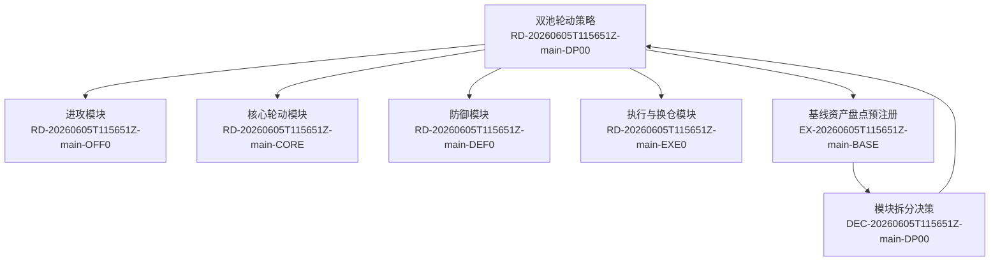

# 研究路线图

本页是路线图说明。真正用于缩放查看的主路线图是 Obsidian Canvas：

```text
00_入口/研究路线图.canvas
```

在 Obsidian 中打开 `.canvas` 文件后，可以用鼠标滚轮缩放、拖拽空白处平移、双击节点打开正文。节点变多后，不要继续扩展 Mermaid 图，应拆分 Canvas。

维护规则见：

```text
08_方法论/路线图维护规范.md
```

## 缩略图

下面的 Mermaid 只作为小型缩略说明，不作为主路线图。



## 阅读顺序

1. 先打开 `00_入口/研究路线图.canvas` 看全局。
2. 再读父方向：`02_研究方向/RD-20260605T115651Z-main-DP00_双池轮动策略.md`
3. 再读四个模块子方向。
4. 再读基线资产盘点实验。
5. 最后读决策卡。
