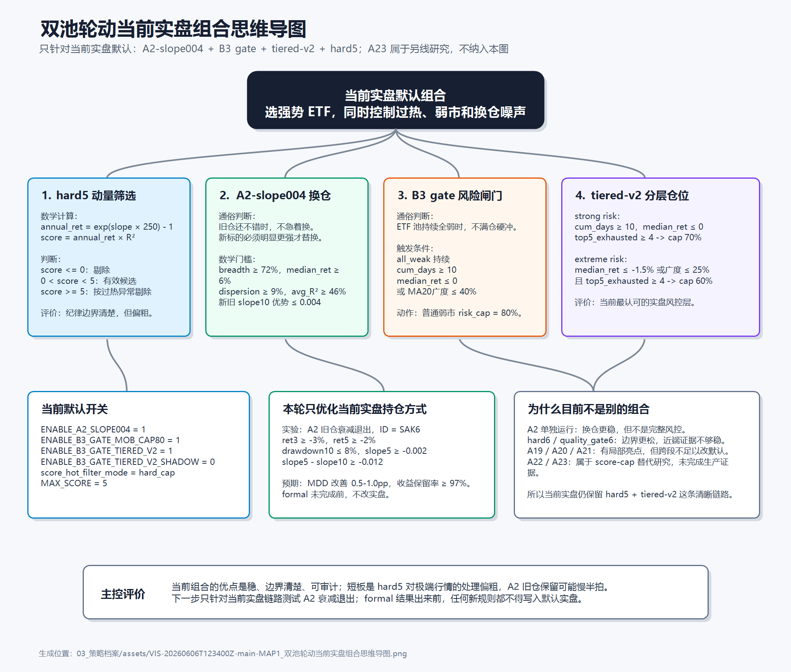

# 双池轮动当前实盘组合思维导图

## 范围边界

本图只解释目前实盘默认策略链路：`A2-slope004 + B3 gate + tiered-v2 + hard5`。

`A23` 属于另一个 score-cap 替代研究方向，不是当前实盘默认，本图不把它作为当前组合的一部分展开。

## 图片版

Obsidian 里直接看下面这张图片即可，不需要安装 plaintext，也不依赖 Mermaid 渲染。

![[03_策略档案/assets/VIS-20260606T123400Z-main-MAP1_双池轮动当前实盘组合思维导图.png]]

兼容 Markdown 查看器的图片链接：

## 可打开版本

- Canvas 版：[[03_策略档案/VIS-20260606T123400Z-main-MAP1_双池轮动当前实盘组合思维导图.canvas|打开 Obsidian Canvas 版]]
- SVG 版：[[03_策略档案/assets/VIS-20260606T123400Z-main-MAP1_双池轮动当前实盘组合思维导图.svg|打开 SVG 图片版]]

## 关联链接

- 策略档案：[[03_策略档案/STRAT-20260605T115651Z-main-DP00_双池轮动策略档案|双池轮动策略档案]]
- 执行与换仓模块：[[02_研究方向/RD-20260605T115651Z-main-EXE0_双池轮动执行与换仓模块|双池轮动执行与换仓模块]]
- score 过热拥挤机制模块：[[02_研究方向/RD-20260605T133318Z-main-H6V3_双池轮动score过热拥挤机制模块|score 过热拥挤机制模块]]
- score-cap 决策：[[05_研究决策/DEC-20260605T000000Z-mig-R010A11F55BE_D20260605-SCORECAP-001score大于5硬过滤保留但进入替代研究|score 大于 5 硬过滤决策]]
- 过热拥挤机制决策：[[05_研究决策/DEC-20260605T000000Z-mig-R010OVERHEAT8BB73_D20260605-OVERHEAT-001过热拥挤机制保留并拆分职责|过热拥挤机制决策]]
- 当前持仓优化实验：[[04_实验记录/EX-20260606T130531Z-main-SAK6_A2旧仓保留负贡献与衰减退出预注册|A2旧仓保留负贡献与衰减退出预注册]]

## 通俗解释

当前实盘不是一个单点规则，而是一条逐层过滤和降风险的链路：

1. `hard5`：先用 `score = annual_ret * R2` 找强趋势，但把 `score >= 5` 的极端高分当成过热风险剔除。
2. `A2-slope004`：如果旧仓还没有明显变坏，且新标的优势没有大到必须换，就继续拿旧仓，减少噪声换仓。
3. `B3 gate`：如果 ETF 池持续全弱，不满仓硬冲，先把普通风险仓压到 80%。
4. `tiered-v2`：弱市继续加深时，把风险仓进一步压到 70% 或 60%。

我的评价：这套当前实盘组合不是最激进的版本，但边界清楚、审计成本低。真正值得继续优化的是“旧仓保留何时变成拖累”，所以本轮新开了 A2 衰减退出实验；在 formal 回测完成前，它只是研究，不是实盘变更。
