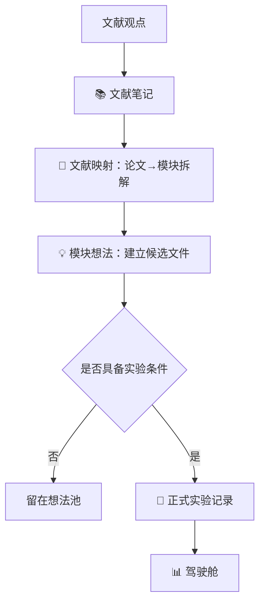

# 模块想法

## 迁移说明

- 迁移状态：机械迁移，尚未人工复核。
- 原旧库 ID：`模块想法`
- 来源旧库路径：`E:\【笔记库】\量化研究库\📖 概念\模块想法.md`
- 新库 ID：`TERM-20260603T000000Z-mig-HD96823B5D9682`
- 证据等级：legacy_raw
- 结论边界：本页保留旧库内容，不代表新库已经采纳旧结论。

## 关联链接

- 迁移总卡：[[11_迁移暂存/MIG-20260605T120000Z-mig-BATCH_旧库批量迁移总卡|旧库批量迁移总卡]]
- 关联方向：待复核
- 关联策略：待复核
- 迁移规范：[[08_方法论/研究库迁移规范|研究库迁移规范]]
- 研究质量审计：[[08_方法论/研究质量审计规范|研究质量审计规范]]

## 复核清单

- [ ] 旧路径真实存在。
- [ ] 平台配置路径真实存在。
- [ ] 平台结果路径真实存在。
- [ ] 实验前假设和证伪条件满足新库标准。
- [ ] 未来函数和过拟合审计满足新库标准。
- [ ] 已同步对应台账和驾驶舱。

## 旧库 Frontmatter

~~~yaml
type: 概念
status: 生效
created_at: 2026-06-03
aliases: [模块想法说明, 想法目录, 想法入口]
tags:
  - 研究
  - 模块想法
~~~
## 旧库原文

~~~markdown
# 模块想法

这里是正式实验之前的研究候选区。所有从期刊、论文、研报、复盘或策略观察中得到的想法，先进入 `💡 想法/`，再根据可实现性决定是否升级为正式实验。

## 目录结构

```
💡 想法/                          ← 只放候选模块，按日期分文件夹
├── 2026-05-21/  (10个)
├── 2026-05-22/  (1个)
├── 2026-05-23/  (9个)
├── 2026-05-28/  (1个)
├── 2026-05-29/  (4个)
└── 2026-05-31/  (1个)

📐 规范/
├── 模块分类标准.md                   ← 模块类型定义 + 升级条件
└── 模块想法模板.md                   ← 新建想法时复制

🔗 文献映射/                        ← 论文 → 模块的映射表
├── 批次1-ETF动量轮动.md
├── 批次2-多策略因子.md
└── 批次3-R010D落地.md

📖 概念/
├── 模块想法.md                      ← 本页：入口与说明
└── 模块候选看板.md                    ← Bases 自动聚合所有想法
```

## 思维流程



## 模块类型

| 类型 | 说明 |
| --- | --- |
| 因子模块 | 动量、低波、质量、估值、资金流、波动率等可打分信号 |
| 组合模块 | TopN、风险平价、波动率缩放、分层权重等组合方式 |
| 风控模块 | 回撤止损、波动率过滤、趋势否决、流动性过滤等 |
| 执行模块 | 日内做T、调仓抗抖、成交过滤、最小换仓阈值等 |
| 诊断模块 | 消融、因子IC、分层收益、换手归因等 |

## 升级为研究记录的条件

- 已明确目标策略
- 已明确基准对照
- 已明确需要哪些数据
- 已明确预期改善指标
- 已明确验证方式，包括样本外或滚动验证

## 想法命名规范

所有模块想法使用统一命名格式：

```
I{YYYYMMDD}-{序号}_{简要描述}.md
```

按创建日期分文件夹存放：

```
💡 想法/YYYY-MM-DD/I20260521-001_波动率缩放仓位.md
```

## 相关入口

| 页面 | 用途 |
| --- | --- |
| [[模块候选看板]] | Bases 自动聚合所有模块想法 |
| [[模块分类标准]] | 模块类型定义和升级条件 |
| [[模块想法模板]] | 新建模块想法时复制 |

相关资源（在其他目录）：

| 文档 | 位置 | 用途 |
| --- | --- | --- |
| 文献笔记 | 📚 文献/ | 论文和期刊阅读笔记 |
| 文献映射 | 🔗 文献映射/ | 论文→模块拆解映射表 |
| 市场状态识别方法库 | 📐 规范/ | 状态识别与无未来函数方法 |
| 涨停事件研究方法库 | 📐 规范/ | 涨停事件和价量结构验证 |
| ETF阴跌防守研究方法库 | 📐 规范/ | ETF 阴跌识别与防守动作 |

~~~