# 研究可视化导航

## 迁移说明

- 迁移状态：机械迁移，尚未人工复核。
- 原旧库 ID：`研究可视化导航`
- 来源旧库路径：`E:\【笔记库】\量化研究库\📦 归档\研究可视化导航.md`
- 新库 ID：`MIG-20260604T000000Z-mig-H0542AA950542A`
- 证据等级：legacy_raw
- 结论边界：本页保留旧库内容，不代表新库已经采纳旧结论。

## 关联链接

- 迁移总卡：[[11_迁移暂存/MIG-20260605T120000Z-mig-BATCH_旧库批量迁移总卡|旧库批量迁移总卡]]
- 关联方向：待复核
- 关联策略：待复核
- 迁移规范：[[08_方法论/研究库迁移规范|研究库迁移规范]]
- 研究质量审计：[[08_方法论/研究质量审计规范|研究质量审计规范]]

## 复核清单

- [ ] 旧路径真实存在。
- [ ] 平台配置路径真实存在。
- [ ] 平台结果路径真实存在。
- [ ] 实验前假设和证伪条件满足新库标准。
- [ ] 未来函数和过拟合审计满足新库标准。
- [ ] 已同步对应台账和驾驶舱。

## 旧库 Frontmatter

~~~yaml
tags:
  - 研究库
  - 可视化
  - Canvas
  - 决策链路
type: 导航
status: archive
archive_status: superseded
superseded_by: "[[📊 驾驶舱]]"
updated_at: 2026-06-03
~~~
## 旧库原文

~~~markdown
# 研究可视化导航

> 归档说明：本文是旧版可视化导航，只保留历史上下文，不作为当前入口。当前入口为 [[📊 驾驶舱]]；当前 Canvas 位于 `E:\【笔记库】\量化研究库\📊 研究全局路线.canvas`。

本页是研究库的可视化入口。Canvas 用于快速理解路线，Markdown 决策节点用于保存可追溯证据。

## 维护规则

- 每一次改变研究方向、候选优先级、交易边界、实盘观察边界或后续实验顺序的判断，都必须有 `09-决策链路/` 下的研究决策卡片。
- 决策卡片使用 [[决策链路说明]] 的格式，必须写清“是什么、相比上个节点、当前判断、证据、反证、下一步”。
- 本页的关键决策节点表必须能找到所有当前主链和重要分支决策。
- `00-入口/研究全局路线.canvas` 是阅读型展示层；主链、候选或边界变化时，同步更新 Canvas 卡片和连线。
- Canvas 卡片至少保留“是什么 / 相比上个节点 / 当前判断”三段摘要，并链接回对应 Markdown 决策卡片。

## 打开方式

Canvas 文件：

```text
00-入口/研究全局路线.canvas
```

若 Canvas 无法直接预览，使用下方 Mermaid 作为同口径文字版。

## 当前主链

```mermaid
flowchart LR
    A["A2-slope004<br/>进攻增强主线"] --> V["A2默认行为回归<br/>21/21通过"]
    A --> A2G["A2二级观察门控<br/>收益修补标签 / 不防守"]
    A --> C1["R010C1 A0失速<br/>只记录日志层"]
    V --> B["B3-cap90<br/>轻防守候选"]
    B --> C["B3全弱持续性<br/>识别强度不足"]
    C --> D["limited2低扰动<br/>回撤有效但收益代价高"]
    D --> E["B3 gate<br/>median_ret<=0 或 MA20广度<=0.40"]
    E --> F["MiniQMT v18<br/>默认关闭映射"]
    E --> G["R026<br/>strict_marker_only"]
    G --> K["R026B-light-cap90<br/>2024首段反证"]
    K --> L["B3 gate离线观察复盘<br/>聚焦误拦截与漏报"]
    L --> M["blocked raw + Top1弱斜率<br/>预注册候选"]
    M --> N["Top1弱斜率 2024压力测试<br/>小幅通过但不promote"]
    N --> T["Top1弱斜率 四段压力测试<br/>observe但不晋级"]
    T --> U["Top1弱斜率误伤归因<br/>只读标签"]
    E --> O["B3 gate强度分层<br/>四段完成，修订tiered-v2"]
    O --> P["tiered-v2预注册<br/>core cap70 + extreme cap60"]
    P --> Q["tiered-v2四段验证<br/>默认关闭候选"]
    Q --> R["tiered-v2默认关闭映射<br/>审计通过"]
    R --> S["tiered-v2影子观察<br/>只记录不交易"]
    S --> LV["tiered-v2实盘启用<br/>用户授权 / v19 / 21项审计"]
    LV --> NB5["R010-B5组合回撤预算<br/>全周期机械缩放需修订"]
    NB5 --> NB5R1["R010-B5R1非线性预算<br/>条件化二级预算代理通过"]
    NB5R1 --> NB5R2["R010-B5R2真实路径2024<br/>叠加通过 / 替代失败"]
    NB5R2 --> NB5R2S["R010-B5R2四段验证<br/>离线候选 / 不实盘"]
    NB5R2S --> NB5R3["R010-B5R3参数与成本smoke<br/>通过 / 待四段"]
    NB5R3 --> NB5R3B["R010-B5R3部分替代边界<br/>只替代强度表达 / 不实盘"]
    NB5R3B --> NB5R3F["R010-B5R3四段压力验证<br/>通过 / 进入影子观察设计"]
    NB5R3F --> NB5R4["R010-B5R4影子观察预注册<br/>只记录建议cap / 不交易"]
    NB5R4 --> NB5R4A["R010-B5R4字段审计<br/>需补shadow日志 / 不交易"]
    NB5R4A --> NB5R4S["R010-B5R4影子日志2024<br/>字段与交易隔离通过 / 待四段"]
    NB5R4S --> NB5R4F["R010-B5R4四段Shadow审计<br/>安全性通过 / 事件代理观察"]
    NB5R4F --> NB5R5P["R010-B5R5严格Counterfactual<br/>预注册 / actual-shadow"]
    NB5R5P --> NB5R5F["R010-B5R5审计未通过<br/>10日edge负 / 不进R6"]
    NB5R5F --> NB5R5R1["R010-B5R5R1失败归因<br/>修订预注册 / 不回测"]
    NB5R5R1 --> NB5R5R1S["R010-B5R5R1窄条件复核<br/>观察级 / 不进R6"]
    NB5R5R1S --> NB5R5R2["R010-B5R5R2环境字段日志<br/>静态通过 / payload旧日志legacy"]
    NB5R5R2 --> NB5R5R2N["R010-B5R5R2新样本复核<br/>同路径失败 / 低median观察"]
    NB5R5R2N --> NB5R5R3["R010-B5R5R3低median复核<br/>事件级为正 / 分段不足"]
    NB5R5R3 --> NB5R5R4["R010-B5R5R4样本外预注册<br/>现有资源非独立 / 暂停R6"]
    NB5R5R4 --> NB5S1["R010-B5S1公式组件映射<br/>只读规格 / 不回测"]
    NB5S1 --> NB5S2["R010-B5S2组件只读审计<br/>输入就绪 / 不回测"]
    NB5S2 --> NB5S3["R010-B5S3组件诊断<br/>主组件无支持 / 暂停公式"]
    NB5S3 --> NB5S4["R010-B5S4样本可用性<br/>无独立样本 / park"]
    E --> W["R020覆盖率缺口复盘<br/>2021 park / 2025强度问题"]
    W --> X["R020A 2021只读标签<br/>解释成立 / 无交易edge"]
    X --> Y["R020A 外推审计<br/>案例标签 / 停止交易化"]
    Y --> Z["R020B 单项拆解<br/>诊断词典 / 不触发"]
    MS["多策略状态归因输入清单<br/>ETF-only / 不可路由"]
    MS --> MS2["ETF族状态归因<br/>解释层 / 不路由"]
    MS2 --> MS3["非ETF净值候选发现<br/>质量单年 / 全周期未就绪"]
    MS3 --> MS4["非ETF全周期基准补齐<br/>预注册 / 先审计"]
    MS4 --> MS5["非ETF候选配置审计<br/>先派生小市值"]
    MS5 --> MS6["小市值全周期配置<br/>dry-run通过"]
    MS6 --> MS7["小市值2024 smoke<br/>通过 / 待时点审计"]
    MS7 --> MS8["小市值时点审计<br/>通过 / 待四段预注册"]
    MS8 --> MS9["小市值四段长测<br/>预注册 / dry-run通过"]
    MS9 --> MS10["小市值四段正式回测<br/>通过 / 待状态归因预注册"]
    MS10 --> MS11["小市值状态归因<br/>预注册 / 只读审计"]
    MS11 --> MS12["小市值状态归因首轮<br/>输入有价值 / 状态证据弱"]
    MS12 --> MS13["小盘专用状态标签<br/>预注册 / 待输入审计"]
    MS13 --> MS14["小盘标签输入审计<br/>本地代理可用 / schema待覆盖"]
    MS14 --> MS15["SchemaOnly覆盖审计<br/>预注册 / 待只读查询"]
    MS15 --> MS16["SchemaOnly覆盖审计<br/>完成 / 待标签构造预注册"]
    MS16 --> MS17["小盘标签构造归因<br/>预注册 / 待只读运行"]
    MS17 --> MS18["小盘标签构造归因首轮<br/>revise / 不路由"]

    H["R015<br/>外部510300开关"] -->|kill| E
    I["A1/A3/A4旧动作"] -->|不恢复| E
    J["R026宽信号"] -->|不做仓位gate| G

    classDef kill fill:#fee2e2,stroke:#b91c1c,color:#111827;
    classDef revise fill:#fef3c7,stroke:#b45309,color:#111827;
    classDef observe fill:#dbeafe,stroke:#1d4ed8,color:#111827;
    classDef promote fill:#dcfce7,stroke:#15803d,color:#111827;
    classDef neutral fill:#f3f4f6,stroke:#4b5563,color:#111827;

    class H,I,J kill;
    class D,G revise;
    class F observe;
    class L observe;
    class M observe;
    class N observe;
    class T observe;
    class A2G observe;
    class C1 observe;
    class U revise;
    class V observe;
    class W revise;
    class X observe;
    class Y revise;
    class Z revise;
    class MS observe;
    class MS2 observe;
    class MS3 observe;
    class MS4 observe;
    class MS5 observe;
    class MS6 observe;
    class MS7 observe;
    class MS8 observe;
    class MS9 observe;
    class MS10 observe;
    class MS11 observe;
    class MS12 observe;
    class MS13 observe;
    class MS14 observe;
    class MS15 observe;
    class MS16 promote;
    class MS17 observe;
    class MS18 revise;
    class O observe;
    class P observe;
    class Q promote;
    class R observe;
    class S observe;
    class LV promote;
    class NB5 revise;
    class NB5R1 promote;
    class NB5R2 promote;
    class NB5R2S promote;
    class NB5R3 promote;
    class NB5R3B observe;
    class NB5R4 observe;
    class NB5R4A revise;
    class NB5R4S observe;
    class NB5R4F observe;
    class NB5R5P observe;
    class NB5R5F revise;
    class NB5R5R1 revise;
    class NB5R5R1S observe;
    class NB5R5R2 observe;
    class NB5R5R2N revise;
    class NB5R5R3 observe;
    class NB5R5R4 revise;
    class NB5S1 observe;
    class NB5S2 observe;
    class NB5S3 observe;
    class NB5S4 observe;
    class K revise;
    class B,E promote;
    class A,C neutral;
```



## 颜色规则

| 颜色 | 含义 |
| --- | --- |
| 绿色 | 可晋级或当前主候选 |
| 蓝色 | 观察中或默认关闭观察 |
| 黄色 | 修订中，机制保留但实现需改 |
| 红色 | 已证伪或禁止恢复 |
| 灰色 | 背景、方法、状态说明 |

## 关键决策节点

| 决策节点 | 判断 | 用途 |
| --- | --- | --- |
| [[D20260529-R014-阴跌分桶过滤修订]] | revise | 分桶阴跌过滤未降回撤，转向池内状态 |
| [[D20260530-R015-外部510300开关证伪]] | kill | 外部 510300 二元开关不再作为主防守触发 |
| [[D20260601-R010B3-cap90进入组合前审计]] | promote | B3-cap90 从风险雷达进入组合前审计 |
| [[D20260601-R010B3-limited2低扰动不直接采纳]] | revise | limited2 有时机信息但不能直接替代 cap90 |
| [[D20260601-R010B3-gate成为当前主候选]] | promote_candidate | B3 gate 成为当前最强防守候选 |
| [[D20260601-R026-strict-marker-only]] | revise | R026 只做低覆盖风险复核标记 |
| [[D20260601-MiniQMT-v18默认关闭映射]] | observe | 实盘具备默认关闭观察条件，但不直接开启 |
| [[D20260602-A2-slope004实盘默认行为回归通过]] | default_behavior_regression_pass | A2-slope004 默认开启、slope004 参数、日志和 B3 默认关闭隔离边界 21/21 通过 |
| [[D20260602-R010B2-A2二级观察门控仅收益修补观察]] | observe_profit_patch_label_no_defense | `candidate_old_edge_or_filter_all_weak` 代理改善 +15.79pp，但有效改善只来自两个事件簇，深回撤 T-10/T+3 覆盖为0；仅收益修补观察 |
| [[D20260602-R010C1-A0失速预警仅日志层]] | observe_log_only_no_trade_action | C1 对 A0 漏防有局部解释价值，但 -15% 深回撤提前覆盖仅 19.05%，2024 覆盖为0；仅保留日志标签 |
| [[D20260602-R020-B3覆盖率缺口复盘完成]] | r020_gap_review_done_2021_park_2025_strength_layer | 2021-05 是未解释触发缺口暂 park；2025-04 是强度缺口，归入 tiered-v2，不再作为新触发器 |
| [[D20260602-R020A-2021慢性失速只读标签审计完成]] | observe_readonly_explanation_no_trade_edge | 2021-05 慢性失速综合标签 T-10 命中 4 天但无交易型 edge，只保留解释标签 |
| [[D20260602-R020A-只读标签外推审计后降为案例标签]] | park_case_label_not_generalizable_trigger | R020A 综合标签独立窗口 T-10 仅 1/3 且漏掉 2022-10，降为案例解释标签 |
| [[D20260602-R020B-单项标签拆解后仅保留诊断词典]] | keep_diagnostic_labels_no_trigger_research | 仅 `leader_surface_strength_decay` 保留为诊断词条，其余标签状态描述、晚确认或剔除，不再触发器化 |
| [[D20260601-R026B-light-cap90进入预注册]] | observe_pre_backtest | R026 B层信号进入低权限离线实验预注册，不进实盘 |
| [[D20260601-R026B-light-cap90首段反证]] | revise | 2024配对首段收益 -1.08pp、回撤仅改善 0.036pp，R026B-light 不继续作为仓位动作候选 |
| [[D20260601-B3-gate离线观察复盘聚焦误拦截与漏报]] | observe | B3 gate 默认关闭观察的历史 watchlist 已生成，后续复核聚焦误拦截、漏报和 active 误伤 |
| [[D20260601-B3-gate误拦截Top1斜率放松进入预注册]] | observe_pre_backtest | blocked raw 中 `top1_slope10<=0.00352` 覆盖 8/8 个后续下探样本，但只能默认关闭压力测试 |
| [[D20260601-B3-gate误拦截Top1斜率放松2024压力测试通过]] | observe_split_validation | 2024 相对 B3 gate 收益 +0.4709pp、回撤改善 +0.0544pp，真正 active 3 天且均来自 blocked raw；进入四段压力测试但不能 promote |
| [[D20260602-B3-gate误拦截Top1斜率放松四段压力测试完成]] | observe_not_promote_history_pressure_pass | 四段拼接相对 B3 gate 收益 +3.48pp、最大回撤改善 +0.0544pp，但 2025-20260519 收益 -2.4583pp 且回撤不改善；只保留观察标签 |
| [[D20260602-B3-gate误拦截Top1斜率放松误伤归因完成]] | revise_to_watch_label_no_new_guardrail | 2025 active 4 天 T+10 全负，误伤来自正 median_ret / 正 breadth 状态被低 Top1 斜率重开；只保留解释标签，不拼新交易规则 |
| [[D20260601-R010B4-B3Gate强度分层进入预注册]] | revise_after_split_validation | B3 gate 后 cap70、cap60、tiered-v1 四段完成；固定强度只保留边界参考，tiered-v1 需修订，不改变当前主候选 |
| [[D20260601-R010B4-tiered-v2进入预注册]] | observe_pre_backtest | R010-B4 tiered-v2 动作日重建首选组合胜率 81.82%、累计 log edge +7.47%；只进入默认关闭实现和 2024 smoke 前置审计 |
| [[D20260601-R010B4-tiered-v2四段验证通过]] | promote_candidate_default_closed | tiered-v2 四段拼接收益 +1468.34%、最大回撤 -27.13%、动作日胜率 77.27%；晋级默认关闭候选但不直接上线 |
| [[D20260601-R010B4-tiered-v2默认关闭映射完成]] | mapped_default_closed | tiered-v2 已映射到 MiniQMT，新增 `ENABLE_B3_GATE_TIERED_V2=0` 与影子观察开关；17/17 审计通过，但不得直接开启 |
| [[D20260601-R010B4-tiered-v2影子观察方案建立]] | observe_shadow_only | 新增 [[R010B4_tiered-v2默认关闭影子观察方案]]；授权演练也只记录候选 cap70/cap60，实际 cap 仍保持 80% |
| [[D20260602-R010B4-tiered-v2实盘启用]] | live_enabled_user_authorized | 用户明确授权后，MiniQMT v19 默认启用 B3 gate 与 tiered-v2；启用审计 21/21 通过，并确认 gate 未 active 不触发旧 cap90 fallback；下一步核验首个交易日启动日志和目标仓位 |
| [[D20260602-R010B5R3-参数敏感性与成本扰动2024Smoke通过]] | promote_to_four_segment_sensitivity_cost_no_live | 非线性回撤预算主候选 2024 参数敏感性与成本扰动 smoke 通过；允许四段验证，但不得实盘、不得后验换参、不得替代 B3 gate 或 tiered-v2 |
| [[D20260602-R010B5R3-部分替代边界定义]] | define_partial_replacement_boundary_no_live | 将“效果好可顶替部分防御模块”限定为后续可证伪路径：只可研究替代固定 cap70/cap60 的强度表达，不替代 B3 gate 或 tiered-v2 风险识别 |
| [[D20260602-R010B5R3-四段敏感性与成本扰动通过]] | promote_to_r010b5r4_shadow_observation_no_live | R010-B5R3 四段参数邻域和成本扰动通过；允许设计默认关闭影子观察，不得实盘，不得替代 B3 gate 或 tiered-v2 风险识别 |
| [[D20260602-R010B5R4-默认关闭影子观察预注册完成]] | observe_shadow_only_no_live | R010-B5R4 预注册完成，只记录非线性建议 cap 与实际 tiered cap 差异；不得修改实盘目标权重、订单或默认开关 |
| [[D20260602-R010B5R4-平台字段审计首轮完成]] | revise_shadow_logging_fields_no_live | 既有日志可还原 B3/tiered cap、回撤状态、阈值和 risk_scale，但缺 shadow 标记、目标权重和订单未改变证明；先补默认关闭影子日志，不得实盘 |
| [[D20260602-R010B5R4-影子日志2024Smoke通过]] | shadow_logging_2024_smoke_pass_no_live | R010-B5R4 默认关闭 SHADOW 日志 2024 smoke 字段与交易隔离通过；242/242 字段覆盖，交易与 B3-gate-tiered-v2 基准一致；待四段与事件后验审计 |
| [[D20260603-R010B5R4-四段Shadow审计通过事件代理观察中]] | observe_counterfactual_prereg_no_live | R010-B5R4 四段 shadow-only 安全性通过：1542/1542 字段覆盖、4/4 分段交易隔离；27 个 lower-cap 事件代理偏正向但未达直接替代门槛，只能进入严格 counterfactual 预注册 |
| [[D20260603-R010B5R5-严格Counterfactual预注册完成]] | counterfactual_preregistered_no_live | R010-B5R5 预注册 actual/shadow 权重局部收益差重建，只读查询日线数据，不回测、不实盘、不替代 B3 gate 或 tiered-v2 |
| [[D20260603-R010B5R5-严格Counterfactual审计未通过]] | revise_counterfactual_edge_failed_no_live | R010-B5R5 27/27 事件可计算，但 10日 edge 正率 37.04%、累计 log edge -0.02890；不进入 R010-B5R6，不整体替代固定 cap 强度表达 |
| [[D20260603-R010B5R5R1-失败归因与公式修订预注册完成]] | revise_to_r010b5r5r1_prereg_no_live | R010-B5R5R1 将失败归因收缩为 strong+extreme、extreme-only 和 strong短周期三个修订候选；normal、risk floor、深回撤和大幅降仓均为反证；不回测、不实盘、不进入 R010-B5R6 |
| [[D20260603-R010B5R5R1-窄条件严格复核观察级完成]] | observe_subset_candidate_weakened_by_segment_conflict_no_live | R010-B5R5R1 窄条件复核完成：A strong+extreme 观察级但 5日分段冲突，B 延迟观察，C 短周期诊断；不进入 R010-B5R6，不回测、不实盘 |
| [[D20260603-R010B5R5R2-事件环境字段日志补全完成]] | env_logging_fields_ready_no_live_wait_new_samples | R010-B5R5R2 仅补齐未来 `R010-B5R4 SHADOW` 的环境字段和事件 CSV 新列；静态字段审计通过，旧日志 payload 仅 `legacy_only/version_missing`，`new_payload_validated=false`；等待新 shadow 样本后先做 payload 审计；不是 R6，不回测、不实盘 |
| [[D20260603-R010B5R5R2-新样本复核与低MedianRet观察]] | revise_same_path_failed_keep_low_median_ret_observe_no_live | 新四段 shadow payload 与交易隔离审计通过，1542/1542 条带 R5R2 环境字段；但 R5 5日/10日仍负，R5R1 仍观察级；低 `median_ret` 既有阈值子集偏正，只能作为 R5R3 预注册线索 |
| [[D20260603-R010B5R5R3-低MedianRet条件只读复核完成]] | observe_low_median_ret_preregistered_candidate_segment_insufficient_no_live | R010-B5R5R3 固定 `median_ret<=-0.015/-0.01` 两个既有阈值只读复核，两个主候选 1/5/10 日事件级 edge 均为正且负控制确认失败；但仅覆盖 2022-2023 与 2024，不能进入 R010-B5R6、不能回测或实盘 |
| [[D20260603-R010B5R5R4-低MedianRet样本外复核预注册完成]] | park_low_median_ret_until_forward_or_independent_oos_no_live | R010-B5R5R4 审计 10 个现有资源后确认 `eligible_independent_resource_count=0`；R2 true path 动作日与 R5R3 全量 27/27 重合；同日 counterfactual 只能复现 R5R3，shadow proxy 只能说明风险窗口偏弱；等待前向或独立 OOS，不进入 R6、不回测、不实盘 |
| [[D20260603-R010B5S1-非线性仓位公式组件映射完成]] | observe_formula_component_spec_only_no_live_no_backtest | R010-B5S1 将非线性仓位公式拆成波动率、趋势、回撤反馈和资金曲线状态四个组件；仅回撤反馈项已有实现且仍观察级，波动率/趋势只部分可用，资金曲线状态缺失；完整乘法公式不得回测、不得 R6、不得实盘 |
| [[D20260603-R010B5S2-波动率项与资金曲线状态组件级只读审计预注册完成]] | observe_component_readonly_audit_inputs_ready_no_formula_backtest | R010-B5S2 从拼接净值派生 T-1 组合级 `sigma_t20/60` 与资金曲线状态，覆盖 27 个事件；但 `sigma_target/vol_scale` 缺失，状态只诊断不决策；不得完整公式回测、不得 R6、不得实盘 |
| [[D20260603-R010B5S3-波动率状态与资金曲线修复组件诊断预注册完成]] | observe_no_component_support_no_formula_backtest | R010-B5S3 固定分组诊断 27 事件，主组件 watch=0、参考 watch=2、负控制污染=0；rolling sigma mid 仅为参考观察，完整公式路线暂停，不进入 R6、不回测、不实盘 |
| [[D20260603-R010B5S4-前向样本可用性审计完成]] | park_forward_confirmation_until_new_independent_samples_no_formula_backtest | R010-B5S4 审计 9 个现有事件资源，合格独立资源数 0，S3 后新增结果目录数 0；rolling sigma mid 只能等待新增前向或独立样本确认，不进入 R6、不回测、不实盘 |
| [[D20260602-M001-多策略状态归因输入清单审计完成]] | observe_input_inventory_etf_only_not_ready_for_routing | 已有全周期状态日志和 13 条 ETF 族可比净值，但缺少小市值、质量价值低波和事件驱动可比净值；只能先做 ETF 族归因，不进入多策略路由 |
| [[D20260602-M002-ETF族状态归因首轮完成]] | observe_etf_family_state_attribution_no_routing | 状态标签可解释 ETF 族内部 A2/B3/tiered-v2 边际；A2 edge 主要来自 `overheat`，B3 gate 改善风险窗口，tiered-v2 解释强度缺口；但仍不能进入多策略路由 |
| [[D20260602-M003-非ETF可比净值候选发现完成]] | non_etf_full_cycle_equity_not_ready_partial_quality_only | 质量类只有 2025 单年候选；小市值和涨停事件只有配置没有结果净值；没有任何非 ETF 必需策略族具备全周期可比净值 |
| [[D20260602-M004-非ETF全周期基准净值补齐进入预注册]] | pre_register_non_etf_full_cycle_baseline_build | 小市值和涨停事件先做只读配置与数据依赖审计；质量类 2025 候选降级为 ETF 质量参数变体；通过后才允许 WSL dry-run、2024 smoke 和四段长测 |
| [[D20260602-M004-非ETF候选配置审计完成]] | config_audit_done_no_direct_backtest_ready | 10 个候选中 9 个阻塞、0 个可直接 dry-run，仅 `v2_migrate_small_cap_t0` 可派生全周期研究配置 |
| [[D20260602-M004-小市值全周期配置DryRun通过]] | small_cap_full_cycle_config_dry_run_pass_ready_for_2024_smoke | M004 小市值全周期研究配置已派生并通过 WSL dry-run；下一步准备 2024 smoke，不能直接进入四段长测或路由 |
| [[D20260602-M004-小市值2024Smoke通过需时点审计]] | small_cap_2024_smoke_pass_needs_timing_audit | M004 小市值 2024 smoke 已生成净值与交易日志；先审计 09:30 调仓字段可见性和 `handle_T` 调度语义，不能直接四段长测或路由 |
| [[D20260602-M004-小市值时点审计通过进入四段预注册]] | small_cap_timing_audit_pass_ready_for_split_prereg | M004 小市值 2024 smoke 修复后复跑结果一致，09:30 事件顺序、字段可见性和 `handle_T` 调度审计通过；允许四段长测预注册，但不能路由或实盘 |
| [[D20260602-M004-小市值四段长测预注册完成]] | small_cap_split_preregistered_dry_run_pass_ready_for_wsl_run | M004 小市值四段长测已完成预注册，4 个 split 配置和 WSL dry-run 均通过；允许正式分段回测，但不能状态归因、路由或实盘 |
| [[D20260602-M004-小市值四段长测通过进入状态归因预注册]] | small_cap_split_backtest_pass_ready_for_state_attribution_prereg | M004 小市值四段正式回测和结果审计通过，四段复合收益 +1704.67%、链式最大回撤 -16.66%；允许新建状态归因预注册和只读归因，仍不能路由或实盘 |
| [[D20260602-M004-小市值状态归因预注册完成]] | small_cap_state_attribution_preregistered_ready_for_readonly_audit | M004 小市值状态归因实验前预测、竞争性解释和只读边界已固定；允许运行只读归因脚本，不允许回测、路由或实盘 |
| [[D20260602-M004-小市值状态归因首轮完成]] | observe_small_cap_input_useful_state_evidence_weak | 小市值首轮只读归因完成，输入有低相关互补价值，但 R010-A 状态解释力偏弱；下一步转小盘专用状态标签预注册 |
| [[D20260602-M005-小盘专用状态标签预注册完成]] | small_cap_specific_state_label_preregistered_ready_for_input_audit | 小盘专用状态标签完成预注册，四类标签族为小盘相对强弱、流动性压力、质量风险和拥挤踩踏；下一步只做输入可得性和时点审计 |
| [[D20260602-M005-小盘专用状态标签输入审计首轮完成]] | observe_partial_input_ready_needs_readonly_coverage_query | 小盘专用状态标签输入可得性首轮只读审计完成，8 个本地代理指标覆盖率达标，但 schema-only 质量风险和市场宽度仍需只读覆盖查询 |
| [[D20260602-M006-小盘SchemaOnly指标覆盖率审计预注册完成]] | schema_only_coverage_audit_preregistered_readonly_query_ready | 小盘 schema-only 指标覆盖率审计预注册完成，只允许 SELECT 聚合查询表字段覆盖和时点语义，不构造标签、不回测、不路由 |
| [[D20260602-M006-小盘SchemaOnly指标覆盖率审计首轮完成]] | promote_to_label_construction_prereg | M006 覆盖率审计通过，允许进入小盘专用状态标签构造与 R039 面板归因预注册，不直接构造标签或路由 |
| [[D20260602-M007-小盘专用状态标签构造与R039面板归因预注册完成]] | small_cap_label_panel_attribution_preregistered_ready_for_readonly_run | M007 固定四类小盘专用标签、R039 面板归因和未来函数审计；下一步只读运行，不回测、不路由、不改实盘 |
| [[D20260602-M007-小盘专用状态标签构造与R039面板归因首轮完成]] | revise_label_definition | M007 首轮只读运行通过审计，但综合压力标签坏日覆盖低于 R010-A，分段稳定性仅 1/4；保留诊断面板，先修订标签定义，不进入组合权重或路由 |

## 当前边界

- 当前实盘主体是用户明确授权后的 `A2-slope004 + B3-gate-tiered-v2`，B3-gate-cap80 保留为历史对照和回滚参照。
- A2-slope004 实盘默认行为回归此前已通过：`ENABLE_A2_SLOPE004=1` 默认开启；本次 v19 启用后，应使用适配“默认启用”口径的 B3/tiered 审计，不再用旧默认关闭审计判断当前状态。
- A2二级观察门控已完成稳定性复核：`candidate_old_edge_or_filter_all_weak` 只保留为收益修补观察标签，不并入 B3 gate、tiered-v2、MiniQMT 或 shadow-only 观察。
- R010C1 A0 失速预警已正式限定为日志层：保留 `r010c1_*` 字段用于 A0 假强势解释，不做 cap、清仓、切 511880，也不并入 B3 gate 或 tiered-v2。
- R020/B3 覆盖率缺口复盘已完成：2021-05 是 B3 all_weak 与 R026 B/C 均未提前覆盖的触发缺口；2025-04 是强度缺口，归入 tiered-v2，不再作为新触发器样本。
- R020A 2021 慢性失速只读标签审计已完成：综合标签 T-10 命中 4 天、触发率 6.36%，但后 20 日收益、回撤和亏损率没有交易型 edge，只保留解释标签。
- R020A 外推审计已完成：综合标签在 2022-10、2023-12、2024-09 独立窗口中 T-10 仅命中 1/3，且完全漏掉 2022-10；不再作为触发器候选。
- R020B 单项标签拆解已完成：`leader_surface_strength_decay` 只保留为诊断词条，其余标签仅状态描述、背景解释、晚确认或剔除；R020A/R020B 标签体系不再交易化。
- R026 不做主撤离、不做硬过滤、不直接驱动仓位。
- MiniQMT v19 已在用户明确授权后默认启用 B3 gate 与 tiered-v2。
- 旧 B3-cap90 fallback 只有在 `ENABLE_B3_ALL_WEAK_CAP90=1` 显式开启时可达；B3 gate 未 active 时不得因为 `ENABLE_B3_GATE_MOB_CAP80=1` 间接降仓。
- [[R010B3_B3-gate默认关闭观察方案]] 已转为历史观察和异常复盘口径；当前不再代表实盘默认状态。
- [[R20260601-027_R026B-light-cap90离线实验预注册]] 已完成 2024 配对首段；结论 `revise`，不继续四段长测，不作为自动仓位动作候选。
- B3 gate 离线观察复盘已生成 290 个观察日和 144 个事件段；后续人工复核优先看 `blocked_false_negative_dd5`、`non_raw_future_dd5_10d` 和 `active_possible_trend_cost`。
- [[R20260601-028_B3-gate误拦截Top1斜率放松预注册]] 的四段压力测试和 2025 误伤归因已完成，结论 `revise_to_watch_label_no_new_guardrail`；不改变当前 B3 gate 主候选，不进入实盘映射。
- [[R20260601-028_R010B4_B3Gate强度分层研究]] 的四段验证已完成，结论为 `revise_after_split_validation`；cap70、cap60 只保留强度边界参考，tiered-v1 需修订为 tiered-v2，不能上线或替换当前 cap80 候选。
- [[R20260601-029_R010B4_B3Gate强度分层TieredV2预注册]] 已完成默认关闭实现、2024 smoke、四段验证、MiniQMT 默认关闭映射和影子观察方案；2026-06-02 用户明确授权后，当前为 `live_enabled_user_authorized`。
- tiered-v2 当前实盘默认组合为 `ENABLE_B3_GATE_MOB_CAP80=1`、`ENABLE_B3_GATE_TIERED_V2=1`、`ENABLE_B3_GATE_TIERED_V2_SHADOW=0`；必须依赖 B3 gate active，不能绕过 `ENABLE_B3_GATE_MOB_CAP80`。
- 首个交易日必须核验 `B3 gate: 开`、`B3-gate-tiered-v2: 交易开 shadow=关`、`tiered_level`、`tiered_effective_cap` 和目标仓位；若 B3 gate inactive 时出现旧 cap90 fallback、cap70/cap60，或日志与目标仓位不一致，按启用前备份回滚。
- R010-B5R3 非线性回撤预算参数敏感性与成本扰动已通过四段验证：40/40 配置有结果，6/6 相邻扰动优于 B3-gate-tiered-v2，两个成本扰动下候选仍优于同成本基准；当前只允许设计 R010-B5R4 默认关闭影子观察，不得实盘，不得替代 B3 gate 或 tiered-v2。
- R010-B5R3 的成本扰动曾发现研究策略硬编码成本覆盖问题，已在研究策略与配置审计脚本中修复；该修复只服务离线研究成本压力测试，不代表修改实盘成本模型。
- R010-B5R3 的“部分替代”边界已定义：四段验证通过后，也只能先做默认关闭影子观察；后续最多研究替代固定 cap70/cap60 的仓位强度表达，不能替代 B3 gate 的风险窗口识别或 tiered-v2 的 strong/extreme 条件。
- R010-B5R3 四段结果存在 5 个重复 summary 配置，已输出 `sensitivity_four_segment_duplicate_runs.csv`；后续引用该结果必须保留该审计文件作为证据风险。
- R010-B5R4 默认关闭影子日志已完成四段 shadow-only 审计：1542/1542 字段覆盖，4/4 分段交易隔离通过；27 个 lower-cap 事件代理偏正向但未达直接替代门槛，已由 R010-B5R5 严格 counterfactual 接续。
- R010-B5R5 严格 counterfactual 已完成：27/27 事件 1/5/10 日均可计算，10日 edge 正率 37.04%、累计 log edge -0.02890；当前 `revise_counterfactual_edge_failed_no_live`，不进入 R010-B5R6，不实盘，不整体替代固定 cap70/cap60 的强度表达。
- R010-B5R5R1 失败归因与公式修订预注册已完成：normal 是主要拖累，risk floor、深回撤和大幅降仓都是反证；后续只允许 strict counterfactual 复核更窄条件，不使用 R010-B5R6 命名，不回测、不实盘。
- R010-B5R5R1 窄条件 strict counterfactual 复核已完成：A 子集只保留观察，B/C 仅诊断；后续不得进入 R010-B5R6，若继续需补环境字段或等待新增样本。
- 多策略状态归因已完成输入清单审计：当前只能做 ETF 族内部状态归因；补齐小市值、质量价值低波和事件驱动全周期可比净值之前，不做自动策略切换或权重路由。
- ETF 族状态归因首轮已完成：可作为 A2/B3/tiered-v2 的只读解释层；同源 ETF 变体证据不得外推为小市值、质量价值低波或事件驱动路由。
- 非 ETF 可比净值候选发现已完成：质量类只有 2025 单年候选，小市值和涨停事件只有配置/代码；补齐全周期结果前，不进入多策略状态归因或自动路由，只允许进入输入补齐预注册。
- M005 小盘专用状态标签输入审计首轮完成：8 个本地代理指标覆盖率达标，可作为只读诊断或上下文候选；schema-only 质量风险、市场宽度、实际流动性和拥挤字段仍需只读覆盖率与时点审计；不构造标签、不回测、不路由、不实盘。
- M006 小盘 schema-only 指标只读覆盖率审计首轮已完成：33 条 SELECT 查询、0 失败，universe 覆盖 100%，日频或估值覆盖 99.94%，当前判断 `promote_to_label_construction_prereg`；已由 M007 接续。
- M007 小盘专用状态标签构造与 R039 面板归因首轮已完成：综合状态覆盖率 96.11%，但压力坏日覆盖 49.29% 低于 R010-A `unfavorable` 57.82%，分段稳定性 1/4；当前 `revise_label_definition`，不进入组合权重或路由。

## 当前观察入口

| 页面 | 用途 |
| --- | --- |
| [[R010B3_B3-gate默认关闭观察方案]] | 定义 raw 全弱、gate 通过、gate blocked、active cap80、人工复核字段和升级边界 |
| [[R20260601-027_R026B-light-cap90离线实验预注册]] | 保存 R026B-light-cap90 预注册、默认关闭实现、2024首段反证和后续边界 |
| [[D20260601-B3-gate离线观察复盘聚焦误拦截与漏报]] | 保存 B3 gate 默认关闭观察的历史复盘结论和人工复核优先级 |
| [[R20260601-028_B3-gate误拦截Top1斜率放松预注册]] | 保存 blocked raw + Top1 斜率放松的实验前假设、预测和证伪规则 |
| [[D20260601-B3-gate误拦截Top1斜率放松2024压力测试通过]] | 保存 2024 压力测试通过但只进入分段验证的路线边界 |
| [[D20260602-B3-gate误拦截Top1斜率放松四段压力测试完成]] | 保存 Top1 斜率放松四段完成但不晋级的路线边界 |
| [[D20260602-B3-gate误拦截Top1斜率放松误伤归因完成]] | 保存 Top1 斜率放松只保留为解释标签、不再交易化的路线边界 |
| [[D20260602-A2-slope004实盘默认行为回归通过]] | 保存 A2 默认开启、slope004 参数、日志和 B3/tiered 默认关闭隔离的回归审计边界 |
| [[D20260602-R010B2-A2二级观察门控仅收益修补观察]] | 保存 A2 二级观察门控仅收益修补、不承担回撤防守、不进实盘映射的路线边界 |
| [[D20260602-R010C1-A0失速预警仅日志层]] | 保存 R010C1 A0 假强势标签仅日志层、不独立交易化的路线边界 |
| [[D20260602-R020-B3覆盖率缺口复盘完成]] | 保存 2021-05 触发缺口暂 park、2025-04 归入 tiered-v2 强度分层的路线边界 |
| [[D20260602-R020A-2021慢性失速只读标签审计完成]] | 保存 2021-05 慢性失速解释标签仅观察、不交易化的路线边界 |
| [[D20260602-R020A-只读标签外推审计后降为案例标签]] | 保存 R020A 综合标签外推失败、停止交易化的路线边界 |
| [[D20260602-R020B-单项标签拆解后仅保留诊断词典]] | 保存 R020A/R020B 标签体系仅保留诊断词典、不触发器化的路线边界 |
| [[R20260601-028_R010B4_B3Gate强度分层研究]] | 保存 B3 gate 后 cap70、cap60、tiered-v1 的强度分层预注册、四段验证结果和 tiered-v2 修订入口 |
| [[D20260601-R010B4-B3Gate强度分层进入预注册]] | 保存 B3 gate 强度分层四段后修订、不进入实盘默认开启的路线边界 |
| [[R20260601-029_R010B4_B3Gate强度分层TieredV2预注册]] | 保存 tiered-v2 的实验前规则、动作日重建证据、证伪规则和下一步实现边界 |
| [[D20260601-R010B4-tiered-v2进入预注册]] | 保存 tiered-v2 只进入默认关闭实现和前置审计的路线边界 |
| [[D20260601-R010B4-tiered-v2四段验证通过]] | 保存 tiered-v2 四段真实路径验证通过、晋级默认关闭候选但不直接上线的路线边界 |
| [[D20260601-R010B4-tiered-v2默认关闭映射完成]] | 保存 tiered-v2 实盘可表达但默认关闭、不得直接开启的路线边界 |
| [[R010B4_tiered-v2默认关闭影子观察方案]] | 定义 tiered-v2 shadow-only 观察开关、日志字段、人工复核项和停止条件 |
| [[D20260601-R010B4-tiered-v2影子观察方案建立]] | 保存 tiered-v2 只记录候选等级、不改变实际仓位的观察边界 |
| [[D20260602-R010B4-tiered-v2实盘启用]] | 保存用户明确授权后 MiniQMT v19 默认启用 B3 gate 与 tiered-v2 的实盘边界、审计证据和回滚条件 |
| [[R20260602-046_R010B5R3_非线性回撤预算参数敏感性与成本扰动预注册]] | 保存非线性回撤预算参数敏感性、成本扰动、2024 smoke 结果和四段验证前置边界 |
| [[R20260602-047_R010B5R4_非线性回撤预算默认关闭影子观察预注册]] | 保存非线性回撤预算默认关闭影子观察的字段规格、晋级条件和停止条件 |
| [[R20260603-048_R010B5R5_非线性回撤预算严格Counterfactual预注册]] | 保存非线性回撤预算事件级 actual/shadow 权重局部收益差重建、预注册门槛和审计未通过结论 |
| [[R20260603-049_R010B5R5R1_非线性回撤预算失败归因与公式修订预注册]] | 保存 R010-B5R5 失败归因、strong+extreme / extreme-only / strong短周期修订候选和禁止进入 R010-B5R6 的边界 |
| [[R010B5R4_非线性回撤预算默认关闭影子观察方案]] | 定义只记录 suggested cap 与 actual tiered cap 差异、不改交易的观察方案 |
| [[D20260602-R010B5R3-参数敏感性与成本扰动2024Smoke通过]] | 保存 R010-B5R3 2024 smoke 通过、允许四段验证但禁止实盘和后验换参的路线边界 |
| [[D20260602-R010B5R3-部分替代边界定义]] | 保存 R010-B5R3 后续部分替代路径的严格定义：先影子观察，再预注册测试强度表达替代，不替代风险识别 |
| [[D20260602-R010B5R3-四段敏感性与成本扰动通过]] | 保存 R010-B5R3 四段压力验证通过、进入默认关闭影子观察设计但不实盘的路线边界 |
| [[D20260602-R010B5R4-默认关闭影子观察预注册完成]] | 保存 R010-B5R4 只观察不交易的边界和下一步字段审计要求 |
| [[D20260602-R010B5R4-平台字段审计首轮完成]] | 保存 R010-B5R4 既有日志字段不足、必须补 shadow-only 交易隔离字段的路线边界 |
| [[D20260602-R010B5R4-影子日志2024Smoke通过]] | 保存 R010-B5R4 默认关闭影子日志 2024 smoke 通过、但仍不得实盘的路线边界 |
| [[D20260603-R010B5R5-严格Counterfactual审计未通过]] | 保存 R010-B5R5 事件级反事实未通过、不得进入 R010-B5R6 和不得实盘的路线边界 |
| [[D20260603-R010B5R5R1-失败归因与公式修订预注册完成]] | 保存 R010-B5R5 失败归因后只能修订窄条件、不得回测和不得使用 R010-B5R6 的路线边界 |
| [[D20260603-R010B5R5R1-窄条件严格复核观察级完成]] | 保存 R010-B5R5R1 窄条件复核后只能观察、不得进入 R010-B5R6 和不得实盘的路线边界 |
| [[D20260603-R010B5R5R2-新样本复核与低MedianRet观察]] | 保存 R010-B5R5R2 新 shadow 样本 payload 通过但同路径复核仍失败、低 median_ret 仅观察的路线边界 |
| [[D20260603-R010B5R5R3-低MedianRet条件只读复核完成]] | 保存 R010-B5R5R3 固定低 median_ret 阈值复核后事件级偏正但分段不足、仍不得进入 R6 或实盘的路线边界 |
| [[D20260603-R010B5R5R4-低MedianRet样本外复核预注册完成]] | 保存 R010-B5R5R4 确认现有结果不能构成独立样本外、低 median_ret 需等待前向或独立 OOS 的路线边界 |
| [[D20260603-R010B5S1-非线性仓位公式组件映射完成]] | 保存 R010-B5S1 将完整非线性仓位公式降为组件规格和只读审计、不得直接回测完整公式的路线边界 |
| [[D20260603-R010B5S2-波动率项与资金曲线状态组件级只读审计预注册完成]] | 保存 R010-B5S2 只读确认组件输入可得但仍禁止完整公式回测、R6 和实盘的路线边界 |
| [[D20260603-R010B5S3-波动率状态与资金曲线修复组件诊断预注册完成]] | 保存 R010-B5S3 固定组件诊断未发现主组件支持、完整公式路线暂停的边界 |
| [[D20260603-R010B5S4-前向样本可用性审计完成]] | 保存 R010-B5S4 确认当前没有新增独立事件样本、rolling sigma mid 需等待前向确认的 park 边界 |
| [[R20260602-034_M001_多策略状态归因输入清单审计]] | 保存多策略状态归因输入清单，确认当前是 ETF-only 可归因、非 ETF 策略族净值缺失 |
| [[D20260602-M001-多策略状态归因输入清单审计完成]] | 保存多策略分支暂不能进入自动路由的边界 |
| [[R20260602-035_M002_ETF族状态归因首轮]] | 保存 ETF 族状态归因首轮，确认状态标签能解释同源 ETF 策略变体边际 |
| [[D20260602-M002-ETF族状态归因首轮完成]] | 保存 ETF-only 归因可做解释层但不能进入多策略路由的边界 |
| [[R20260602-036_M003_非ETF可比净值候选发现审计]] | 保存非 ETF 策略族净值候选发现，确认质量类只有 2025 单年候选 |
| [[D20260602-M003-非ETF可比净值候选发现完成]] | 保存非 ETF 全周期净值未就绪、不进入多策略归因的边界 |
| [[R20260602-037_M004_非ETF全周期基准净值补齐预注册]] | 保存小市值、涨停事件和质量方向补齐全周期基准净值的审计闸门 |
| [[D20260602-M004-非ETF全周期基准净值补齐进入预注册]] | 保存多策略分支先补输入、不进入自动路由的最新边界 |
| [[D20260602-M004-非ETF候选配置审计完成]] | 保存 10 个候选配置审计完成、先派生小市值全周期配置的路线边界 |
| [[D20260602-M004-小市值全周期配置DryRun通过]] | 保存小市值全周期配置已通过 dry-run、下一步仅准备 2024 smoke 的路线边界 |
| [[D20260602-M004-小市值2024Smoke通过需时点审计]] | 保存小市值 2024 smoke 已跑通、四段前需执行时点审计的路线边界 |
| [[D20260602-M004-小市值时点审计通过进入四段预注册]] | 保存小市值执行时点审计通过、允许四段长测预注册但禁止路由和实盘的路线边界 |
| [[R20260602-038_M004_小市值四段长测预注册]] | 保存小市值四段正式回测的实验前假设、竞争性解释和验收规则 |
| [[D20260602-M004-小市值四段长测预注册完成]] | 保存小市值四段配置 dry-run 通过、允许正式 WSL 分段回测但禁止路由和实盘的路线边界 |
| [[D20260602-M004-小市值四段长测通过进入状态归因预注册]] | 保存小市值四段正式回测与结果审计通过、允许进入只读状态归因预注册但禁止路由和实盘的路线边界 |
| [[R20260602-039_M004_小市值状态归因预注册]] | 保存小市值状态归因的实验前预测、证伪规则、只读边界和首轮审计结果 |
| [[D20260602-M004-小市值状态归因预注册完成]] | 保存小市值状态归因只读审计可执行边界 |
| [[D20260602-M004-小市值状态归因首轮完成]] | 保存小市值输入有价值但 R010-A 状态证据弱、不允许直接路由的路线边界 |
| [[R20260602-040_M005_小盘专用状态标签预注册]] | 保存小盘专用状态标签的实验前预测、候选标签族、只读输入审计边界和首轮输入审计结果 |
| [[D20260602-M005-小盘专用状态标签预注册完成]] | 保存小盘专用状态标签只读输入可得性审计的路线边界 |
| [[D20260602-M005-小盘专用状态标签输入审计首轮完成]] | 保存本地代理可用、schema-only 指标需只读覆盖查询、不允许构造标签或路由的路线边界 |
| [[R20260602-041_M006_小盘SchemaOnly指标只读覆盖率审计预注册]] | 保存 schema-only 指标只读覆盖率审计的对象、输出、通过规则和禁止项 |
| [[D20260602-M006-小盘SchemaOnly指标覆盖率审计预注册完成]] | 保存只读 SELECT 聚合查询可执行、但仍禁止标签构造和交易化的路线边界 |
| [[D20260602-M006-小盘SchemaOnly指标覆盖率审计首轮完成]] | 保存 M006 审计通过、允许进入标签构造预注册但仍禁止回测和路由的路线边界 |
| [[R20260602-042_M007_小盘专用状态标签构造与R039面板归因预注册]] | 保存四类小盘专用标签构造、R039 面板归因、消融、关键窗口和未来函数审计预注册 |
| [[D20260602-M007-小盘专用状态标签构造与R039面板归因预注册完成]] | 保存 M007 只读运行授权边界，不回测、不路由、不改实盘 |
| [[D20260602-M007-小盘专用状态标签构造与R039面板归因首轮完成]] | 保存 M007 首轮标签面板与归因结果、`revise_label_definition` 决策和下一步修订边界 |
## 2026-06-02补充：R010-B5组合回撤预算离线分支

新增决策节点：

| 决策节点 | 判断 | 用途 |
| --- | --- | --- |
| [[D20260602-R010B5-组合回撤预算动态缩放代理审计完成]] | revise_proxy_return_drag_no_live | 保存组合净值回撤预算的首轮代理审计结论：回撤能改善，但收益保留率和动作日质量不足，暂不实盘 |

R010-B5 在路线图中的位置：

```text
B3-gate-tiered-v2 实盘启用
  -> R010-B5 组合回撤预算代理审计
  -> 当前结论 revise_proxy_return_drag_no_live
  -> 若继续，只能转向 B3/tiered 条件化二级预算预注册
```

边界：

```text
该节点不是实盘增强，不修改 MiniQMT，不替代 B3 gate 或 tiered-v2。
净值层代理只用于快速证伪路径拖累；正式策略路径回测需要另行预注册。
```
## 2026-06-02补充：R010-B5R1非线性组合回撤预算代理审计

新增节点：

```text
[[D20260602-R010B5R1-非线性组合回撤预算代理审计通过]]
```

导航位置：

```text
D20260602-R010B5-组合回撤预算动态缩放代理审计完成
  -> D20260602-R010B5R1-非线性组合回撤预算代理审计通过
```

节点含义：

```text
R010-B5R1 将全周期硬分档降仓修订为只在 B3/tiered 风险窗口内生效的指数型连续缩放。
代理审计中 nl_endo_gate_any_d10_a5_f70 收益保留率 107.73%，回撤改善 +1.14pp，动作日胜率 81.48%。
当前判断 promote_proxy_candidate_for_true_path_no_live，只允许进入真实路径回测预注册，不得实盘。
```

## 2026-06-02补充：R010-B5R2非线性回撤预算真实路径2024 Smoke

新增节点：

```text
[[D20260602-R010B5R2-非线性回撤预算真实路径2024Smoke通过]]
```

导航位置：

```text
D20260602-R010B5-组合回撤预算动态缩放代理审计完成
  -> D20260602-R010B5R1-非线性组合回撤预算代理审计通过
  -> D20260602-R010B5R2-非线性回撤预算真实路径2024Smoke通过
```

节点含义：

```text
R010-B5R2 将 R010-B5R1 的净值层代理候选推进到真实策略路径。
2024 smoke 中 overlay_tiered_v2_nonlinear 收益 +71.57%、最大回撤 -24.63%，相对 B3-gate-tiered-v2 收益 +4.57pp、回撤改善 +2.36pp。
replace_tiered_fixed_caps_nonlinear 收益 +64.71%、最大回撤 -28.19%，相对基准收益 -2.30pp、回撤差 -1.20pp，因此停止作为替代 tiered 固定 cap70/cap60 的候选。
当前判断 promote_overlay_to_four_segment_kill_replacement_no_live，只允许叠加版四段真实路径验证，不得实盘。
```

## 2026-06-02补充：R010-B5R2非线性回撤预算四段真实路径验证

新增节点：

```text
[[D20260602-R010B5R2-非线性回撤预算四段真实路径验证通过]]
```

导航位置：

```text
D20260602-R010B5-组合回撤预算动态缩放代理审计完成
  -> D20260602-R010B5R1-非线性组合回撤预算代理审计通过
  -> D20260602-R010B5R2-非线性回撤预算真实路径2024Smoke通过
  -> D20260602-R010B5R2-非线性回撤预算四段真实路径验证通过
```

节点含义：

```text
R010-B5R2 叠加版已完成四段真实路径验证。
四段拼接收益 +1534.91%、最大回撤 -25.33%，相对 B3-gate-tiered-v2 收益 +66.57pp、回撤改善 +1.80pp。
动作日 27 天，胜率 77.78%，平均超额 +0.691pp。
当前判断 promote_offline_candidate_no_live；只允许进入参数敏感性、成本扰动和影子观察边界预注册，不得实盘。
```

## 2026-06-02补充：R010-B5R3参数敏感性与成本扰动2024 Smoke

新增节点：

```text
[[D20260602-R010B5R3-参数敏感性与成本扰动2024Smoke通过]]
```

导航位置：

```text
D20260602-R010B5-组合回撤预算动态缩放代理审计完成
  -> D20260602-R010B5R1-非线性组合回撤预算代理审计通过
  -> D20260602-R010B5R2-非线性回撤预算真实路径2024Smoke通过
  -> D20260602-R010B5R2-非线性回撤预算四段真实路径验证通过
  -> D20260602-R010B5R3-参数敏感性与成本扰动2024Smoke通过
```

节点含义：

```text
R010-B5R3 验证 R010-B5R2 主候选的相邻参数稳定性和成本稳定性。
6个相邻参数扰动均优于 B3-gate-tiered-v2。
修复成本覆盖后，佣金0.02% 与 佣金0.02%+2bps滑点 下候选仍优于同成本基准。
当前判断 promote_to_four_segment_sensitivity_cost_no_live；下一步四段验证，不得实盘，不得替代 B3 gate 或 tiered-v2。
```

~~~