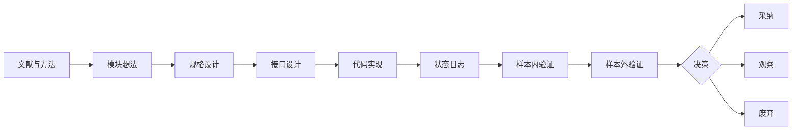

# 研究进度驾驶舱

## 迁移说明

- 迁移状态：机械迁移，尚未人工复核。
- 原旧库 ID：`研究进度驾驶舱`
- 来源旧库路径：`E:\【笔记库】\量化研究库\📦 归档\研究进度驾驶舱.md`
- 新库 ID：`MIG-20260604T000000Z-mig-HDA5165C3DA516`
- 证据等级：legacy_raw
- 结论边界：本页保留旧库内容，不代表新库已经采纳旧结论。

## 关联链接

- 迁移总卡：[[11_迁移暂存/MIG-20260605T120000Z-mig-BATCH_旧库批量迁移总卡|旧库批量迁移总卡]]
- 关联方向：待复核
- 关联策略：待复核
- 迁移规范：[[08_方法论/研究库迁移规范|研究库迁移规范]]
- 研究质量审计：[[08_方法论/研究质量审计规范|研究质量审计规范]]

## 复核清单

- [ ] 旧路径真实存在。
- [ ] 平台配置路径真实存在。
- [ ] 平台结果路径真实存在。
- [ ] 实验前假设和证伪条件满足新库标准。
- [ ] 未来函数和过拟合审计满足新库标准。
- [ ] 已同步对应台账和驾驶舱。

## 旧库 Frontmatter

~~~yaml
tags:
  - 研究库
  - 进度驾驶舱
  - Bases
type: 导航
status: archive
archive_status: superseded
superseded_by: "[[📊 驾驶舱]]"
updated_at: 2026-06-03
~~~
## 旧库原文

~~~markdown
# 研究进度驾驶舱

> 归档说明：本文是旧版进度驾驶舱，只保留历史上下文，不作为当前入口。当前入口为 [[📊 驾驶舱]]，实验和结果资产索引见 [[研究资产清单]]。

本页用于快速查看研究、策略、因子模块的当前开发进展。当前是试用版，重点展示主线研究，不追求覆盖所有历史细节。

## 当前主线

| 主线                                  | 当前阶段                                                                    |  进度 | 阻塞                | 下一步                                        |
| ----------------------------------- | ----------------------------------------------------------------------- | --: | ----------------- | ------------------------------------------ |
| [[研究方法论]]                | 方法论启用                                                                   | 25% | 需由后续研究记录执行落地      | 按 [[Agent研究方法论交接]] 改造当前主线研究                |
| [[BLF20260523-001_市场状态识别与动量门控研究信念]] | A2-slope004+B3-gate-tiered-v2 已在用户明确授权后切换为 MiniQMT v19 实盘默认启用；A2-slope004 实盘默认行为回归此前 21/21 通过；A2二级观察门控稳定性复核后仅保留收益修补观察标签；R010-B4 tiered-v2 四段验证通过并完成 v19 启用审计 21/21；R020A/R020B 标签体系已收口，仅保留诊断词典；Top1 斜率放松误伤归因完成并收缩为只读标签；R026B-light 已反证 | 100% | 首个交易日启动日志与目标仓位尚待核验 | 核验 `B3 gate: 开`、`B3-gate-tiered-v2: 交易开 shadow=关`、tiered_level/tiered_effective_cap 和目标仓位；A2二级、R020B、R010C1 与 Top1 放松都不再作为防守或仓位规则 |
| [[BLF20260523-002_平滑上涨软排序研究信念]]     | 信念种子已建                                                                  | 35% | 依赖状态门控            | 在 `rotational_momentum` 中条件启用 R9           |
| [[BLF20260523-003_波动率管理与条件降仓研究信念]]  | R010-B5R5 严格 counterfactual 已反证整体替代路径；R010-B5R5R4 确认低 `median_ret` 缺独立样本外；R010-B5S1/S2 将非线性仓位公式拆成组件并确认输入可得；R010-B5S3 固定分组诊断完成，主组件 watch=0、参考 watch=2；R010-B5S4 审计确认当前无新增独立事件样本 | 100% | 整体替代路径未通过；低 `median_ret<=-0.015/-0.01` 子集缺独立样本外；`sigma_target/vol_scale` 缺失；资金曲线修复仅 3 事件；主组件没有足够证据；现有 9 个事件资源均与 S3 27 事件重叠 | `park_forward_confirmation_until_new_independent_samples_no_formula_backtest`：完整公式路线暂停；等待新增独立样本后才允许窄确认 rolling sigma mid；不进入 R010-B5R6，不回测，不扫描目标波动率，不修改 MiniQMT、不实盘 |
| [[BLF20260528-004_市场环境驱动多策略切换研究信念]] | M007 小盘专用状态标签构造与 R039 面板归因首轮完成，结论 `revise_label_definition` | 98% | 综合压力标签坏日覆盖低于 R010-A unfavorable，分段稳定性仅 1/4；open_capacity_0930 精确 09:30 历史覆盖仅 9/1542，只能作执行容量审计；质量价值低波和事件驱动全周期可比净值仍缺 | 不进入组合层权重或路由；若继续，先新建 M007-R1 标签修订预注册 |
| [[07-市场状态识别专题]]                     | B3 gate 四段通过并完成 MiniQMT v18 默认关闭映射，R010-B4 tiered-v2 四段验证通过后已在用户授权下升级为 MiniQMT v19 默认启用；A2二级观察门控稳定性复核后 `observe_profit_patch_label_no_defense`；R020 缺口复盘确认 2021-05 是触发缺口、2025-04 归入 tiered-v2 强度问题；R020A/R020B 只读标签体系不支持交易化，仅保留诊断词典 | 100% | 首个交易日启动日志与目标仓位尚待核验 | 检查 v19 启动日志、B3 gate active 日志和 tiered-v2 分层生效；A2二级与R020B不继续防守交易化 |
| [[08-多策略市场环境切换专题]]                  | M007 小盘专用状态标签构造与 R039 面板归因首轮完成，覆盖和未来函数审计通过但标签效果不足 | 98% | 综合压力标签坏日覆盖 49.29%，低于 R010-A unfavorable 57.82%；分段稳定性 1/4 | 不交易；保留诊断面板，若继续必须先做 M007-R1 标签修订预注册 |
| [[09-涨停事件价量结构专题]]                   | 专题建立                                                                    | 15% | 回测平台升级中，集合竞价数据待确认 | 先做事件基准和成交容量实验设计                            |
| [[10-ETF阴跌防守专题]]                    | A2-slope004+B3-gate-tiered-v2 已切换为用户授权后的 MiniQMT v19 默认实盘启用；R010-B4 tiered-v2 四段拼接收益 +1468.34%、最大回撤 -27.13%、动作日胜率 77.27%，v19 启用审计 21/21 通过；A2二级观察门控仅收益修补观察；R020/R020A/R020B 标签体系已收口；Top1 斜率放松 `revise_to_watch_label_no_new_guardrail`；R026B-light 降回复核标记 | 100% | 首个交易日启动日志与目标仓位尚待核验 | 核验 v19 启动与分层日志；A2二级、Top1 放松与 R020B 诊断词典不替代主 gate、不拼后验 guardrail；若异常按 v19 启用前备份回滚 |
| [[🔗 文献映射/批次2-多策略因子]]                    | 文献储备完成                                                                  | 35% | 暂不回测              | 从 [[因子稳健性与失效监控]] 和 [[尾部风险与波动风险溢价预警]] 先拆规格  |
| [[平滑上涨]]                            | 样本外验证完成                                                                 | 80% | 等待状态门控复用          | 作为 `smooth_soft_rank` 模式候选                 |
| [[波动率管理]]                           | 观察中                                                                     | 40% | 需要复核不同市场环境        | 进入状态门控的风险确认层                               |
| [[防守切换]]                            | B3-gate-median-or-breadth-cap80 四段通过并完成默认关闭映射；R010-B4 tiered-v2 四段验证通过，并在用户授权后完成 MiniQMT v19 默认实盘启用；R026 硬过滤被反证 | 100% | 首个交易日启动日志与目标仓位尚待核验 | 检查 v19 日志与仓位；不新增 R026/A1/A3/A4 动作；异常时回滚到启用前备份 |

## 研究记录总览

```base
filters:
  and:
    - file.inFolder("05-实验记录")
    - type == "研究记录"
properties:
  file.name:
    displayName: 文件
  research_id:
    displayName: 编号
  related_strategy:
    displayName: 策略
  related_factor:
    displayName: 因子模块
  research_stage:
    displayName: 阶段
  progress:
    displayName: 进度
  status:
    displayName: 状态
  decision:
    displayName: 决策
  blocker:
    displayName: 阻塞
  next_action:
    displayName: 下一步
views:
  - type: table
    name: 全部研究进度
    order:
      - file.name
      - research_id
      - related_strategy
      - related_factor
      - research_stage
      - progress
      - status
      - decision
      - blocker
      - next_action
```

## 阻塞事项

## 最近补充

| 更新 | 结果 | 下一步 |
| --- | --- | --- |
| R010-B5S4滚动波动率中位参考分组前向样本可用性审计完成 | 已新增 [[D20260603-R010B5S4-前向样本可用性审计完成]]；脚本 `scripts/research/audit_r010b5s4_forward_sample_readiness.py` 只读运行，不连接数据库、不回测、不更新数据、不修改实盘；审计 9 个现有资源，`eligible_independent_resource_count=0`，`newer_result_dir_count_after_s3_excluding_s_series=0`，S2/S3/R5/R5R2/R4 shadow/R5R2 shadow/R5R3 事件日期均与 S3 27 个事件完全重叠 | `park_forward_confirmation_until_new_independent_samples_no_formula_backtest`：等待新增前向或独立 shadow-only 事件样本；新事件不少于 8 个且不少于 2 个分段前，不得确认 rolling sigma mid，更不得完整公式回测、R6 或实盘 |
| R010-B5S3波动率状态与资金曲线修复组件诊断完成 | 已新增 [[D20260603-R010B5S3-波动率状态与资金曲线修复组件诊断预注册完成]]；脚本 `scripts/research/analyze_r010b5s3_component_diagnostics.py` 只读运行，不连接数据库、不回测、不更新数据、不修改实盘；27 个事件固定分组诊断，主组件 watch=0、参考 watch=2、负控制污染=0；`sigma20_rank_state=mid` 12 事件 5/10 日均值 +0.001523/+0.001689，`sigma60_rank_state=mid` 11 事件 +0.000160/+0.001417，但均只作参考观察 | `observe_no_component_support_no_formula_backtest`：完整公式路线暂停；不得完整公式回测、不得 R6、不得扫描目标波动率、不得实盘 |
| R010-B5S2波动率项与资金曲线状态组件级只读审计完成 | 已新增 [[D20260603-R010B5S2-波动率项与资金曲线状态组件级只读审计预注册完成]]；脚本 `scripts/research/analyze_r010b5s2_component_readonly_audit.py` 只读运行，不连接数据库、不回测、不更新数据、不修改实盘；从 B3-gate-tiered-v2 1542 行拼接净值派生 T-1 `sigma_t20/60` 与资金曲线状态，并合并 27 个 R010-B5 counterfactual 事件；`event_source_lag_full_count=27/27`，字段 11 项 pass，`sigma_target` 与 `vol_scale` 为 `missing_by_design`；资金曲线状态 24/27 为 `deep_drawdown_not_recovering`，3/27 为 `recovering_deep_drawdown` | 已由 R010-B5S3 接续；S2 边界不变：不得完整公式回测、不得 R6、不得扫描目标波动率、不得实盘 |
| R010-B5S1非线性仓位公式组件映射完成 | 已新增 [[D20260603-R010B5S1-非线性仓位公式组件映射完成]]；脚本 `scripts/research/analyze_r010b5s1_formula_component_map.py` 只读运行，不连接数据库、不回测；组件结论：波动率项 partial，`realized_vol` 只是风险代理且 `sigma_target` 缺失；趋势项 partial_parked，回撤反馈项 implemented_observe，[[资金曲线状态]] missing，完整乘法公式 `blocked_by_component_gaps`；未来最小字段包括 `source_lag_days`、`sigma_t`、`vol_scale`、`trend_tanh_scale`、`capital_curve_state`、`component_product_cap` 和 `component_cap_reason` | 已由 R010-B5S2 接续完成输入可得性审计；S1 边界不变：不得直接完整公式回测、不得 R6、不得实盘 |
| R010-B5R5R4低MedianRet样本外复核预注册完成 | 已新增 [[D20260603-R010B5R5R4-低MedianRet样本外复核预注册完成]]；脚本 `scripts/research/analyze_r010b5r5r4_existing_result_crosscheck.py` 只读运行，审计 10 个现有资源，`eligible_independent_resource_count=0`；R2 true path 动作日与 R5R3 全量事件 27/27 重合，P1 8/8、P2 13/13 重合；同日 counterfactual 只复现 R5R3，shadow future-return proxy 只能说明风险窗口偏弱，不能证明交易 edge | `park_low_median_ret_until_forward_or_independent_oos_no_live`：等待前向或独立 OOS；不进入 R010-B5R6，不运行真实路径回测，不实盘 |
| R010-B5R5R3低MedianRet条件只读复核完成 | 已新增 [[D20260603-R010B5R5R3-低MedianRet条件只读复核完成]]；脚本 `scripts/research/analyze_r010b5r5r3_low_median_ret_strict_review.py` 只读运行，固定既有阈值且禁止扫描；`median_ret<=-0.015` 8 事件 1/5/10 日 log edge +0.00433/+0.00597/+0.01302，`median_ret<=-0.01` 13 事件 +0.01495/+0.00708/+0.01495；全量、非低 median、normal-only 负控制均保持失败；`median_ret<=-0.0141` 标记为后验禁止参考 | `observe_low_median_ret_preregistered_candidate_segment_insufficient_no_live`：两个主候选只覆盖 2022-2023 与 2024，不能进入 R010-B5R6、不能回测、不能实盘；后续只在新增样本或独立样本外预注册中复核 |
| R010-B5R5R2新Shadow样本复核与环境归因 | 已新增 [[D20260603-R010B5R5R2-新样本复核与低MedianRet观察]]；新四段 shadow payload 审计 `field_pass_payload_pass/versioned_payload_pass`，1542/1542 条带 `R010-B5R5R2-env-v1`，交易隔离 4/4 通过；但 R5 同口径 5日 log edge -0.02470、10日 -0.02890，10日正率 37.04%；R5R1 strong+extreme 仍仅观察级；低 `median_ret<=-0.015/-0.01` 子集偏正但为小样本环境归因，已由 R010-B5R5R3 接续复核 | `revise_same_path_failed_keep_low_median_ret_observe_no_live`：同路径失败结论不反转；不进入 R010-B5R6，不实盘；R5R3 接续后仍为 observe |
| R010-B5R5R2事件环境字段日志补全完成 | 已新增 [[D20260603-R010B5R5R2-事件环境字段日志补全完成]]；研究策略 `R010-B5R4 SHADOW` 追加 `r010b5r5r2_env_log_version`、`median_ret`、`ma20_breadth`、`dispersion`、`avg_r2`、Top5、B3 filter、B3 gate 与 tiered-v2 字段；事件聚合脚本同步输出新列；2024 旧日志兼容 smoke 通过，242 条 shadow 行、12 条非零 cap_delta、0 warning；静态字段审计 `field_pass_static_only/field_audit_pass`，策略字段 138、事件字段 138、CSV 总字段 171、高危失败 0；旧日志 payload 扫描 `field_pass_payload_legacy_only`，1542 条 payload 均为 `legacy_only/version_missing`，`new_payload_validated=false`；强制新版本 payload 探针按预期失败 | `env_logging_fields_ready_no_live_wait_new_samples`：不是 R010-B5R6，不回测、不实盘；等待新 shadow 样本后先做 payload 审计，通过后再复跑 R5/R5R1 同口径复核 |
| R010-B5R5R1窄条件严格复核观察级完成 | 已新增 [[D20260603-R010B5R5R1-窄条件严格复核观察级完成]]；脚本 `scripts/research/analyze_r010b5r5r1_subset_counterfactual.py` 只读运行，A strong+extreme 12 事件 1日 log +0.00638、10日 +0.00406，但 5日为 -0.00202 且分段冲突；B extreme 仅10日为正；C strong 仅1/5日短周期为正 | `observe_subset_candidate_weakened_by_segment_conflict_no_live`：观察级保留，不进入 R010-B5R6，不回测、不实盘；后续先补环境字段或等待新增样本 |
| R010-B5R5R1失败归因与公式修订预注册 | 已新增 [[D20260603-R010B5R5R1-失败归因与公式修订预注册完成]]；脚本 `scripts/research/analyze_r010b5r5_failure_attribution.py` 只读运行，确认 normal 15 事件 10日 log edge -0.03297 是主要拖累；`risk_scale<=0.7` 13 事件 10日 log edge -0.03101，深回撤与大幅降仓也显著为负 | `revise_to_r010b5r5r1_prereg_no_live`：不使用 R010-B5R6 命名，不回测、不实盘；下一步仅可对 strong+extreme、extreme-only 和 strong短周期做严格 counterfactual 复核 |
| R010-B5R5严格Counterfactual审计未通过 | 已新增 [[D20260603-R010B5R5-严格Counterfactual审计未通过]]；脚本 `scripts/research/analyze_r010b5r5_counterfactual_events.py` 在 WSL 只读运行，27/27 非零 `cap_delta` 事件 1/5/10 日均可计算；1日累计 log edge +0.00397，但 5日 -0.02470、10日 -0.02890，10日正率 37.04% | `revise_counterfactual_edge_failed_no_live`：不进入 R010-B5R6，不实盘，不整体替代固定 cap70/cap60；若继续，只能研究更窄 extreme 子集或重定义公式 |
| R010-B5R4四段Shadow审计通过但事件代理观察中 | 已新增 [[D20260603-R010B5R4-四段Shadow审计通过事件代理观察中]]；四段 shadow-only 字段审计 `field_ready`，1542/1542 字段覆盖，66 个 B3/tiered active 日；4/4 分段交易隔离通过，summary、净值、成交和订单均与 B3-gate-tiered-v2 基准一致；27 个 lower-cap 事件中 10日亏损窗口 19/27 | `observe_counterfactual_prereg_no_live`：安全性通过，但事件代理未达直接部分替代强度；下一步只能新建 R010-B5R5 严格 counterfactual 预注册，不改 MiniQMT、不实盘、不替代 B3 gate 或 tiered-v2 |
| R010-B5R4影子日志2024Smoke通过 | 已新增 [[D20260602-R010B5R4-影子日志2024Smoke通过]]；研究策略新增默认关闭 `r010b5r4_shadow_observation_enabled`，配置 `configs/research/R010-B5/r010b5r4_shadow_observation_2024.json` 跑通；审计 242/242 字段覆盖，20 个 B3/tiered active 日中 12 天给出更低 suggested cap；净值、收益、回撤、成交和订单与 B3-gate-tiered-v2 2024 基准一致，`nonlinear_live_enabled=true` 和 `orders_changed_by_shadow=true` 均为 0 | `shadow_logging_2024_smoke_pass_no_live`：下一步四段 shadow-only 审计和非零 `cap_delta` 后验 1/5/10 日收益审计；不得修改 MiniQMT、不得实盘、不得替代 B3 gate 或 tiered-v2 |
| R010-B5R4平台字段审计首轮完成 | 已新增 [[D20260602-R010B5R4-平台字段审计首轮完成]]；脚本 `scripts/research/audit_r010b5r4_shadow_observation_fields.py` 只读审计 45 个 R010-B5R2/R3 结果目录、14120 条预算观察行；B3/tiered cap、回撤状态、阈值和 risk_scale 可完整还原，但 shadow 标记、live 开关证明、真实/影子目标权重和订单未改变证明缺失 | `revise_shadow_logging_fields_no_live`：不能直接进入观察；下一步审计平台插桩点并补默认关闭 `R010-B5R4 SHADOW` 日志，不修改 MiniQMT、不得实盘、不得替代 B3 gate 或 tiered-v2 |
| R010-B5R3参数敏感性与成本扰动四段通过 | 已新增 [[D20260602-R010B5R3-四段敏感性与成本扰动通过]]；脚本 `scripts/research/analyze_r010b5r3_sensitivity_four_segment.py` 汇总四段结果，40/40 配置有结果；6/6 相邻扰动优于 B3-gate-tiered-v2；两个成本扰动下候选均优于同成本基准；5个重复summary已输出审计文件 | `promote_to_r010b5r4_shadow_observation_no_live`：只允许设计默认关闭影子观察；不得实盘，不得替代 B3 gate 或 tiered-v2 风险识别，不得后验换参 |
| R010-B5R2非线性回撤预算四段真实路径 | 已新增 [[D20260602-R010B5R2-非线性回撤预算四段真实路径验证通过]]；脚本 `scripts/research/analyze_r010b5r2_true_path_four_segment.py` 汇总四段真实路径，overlay 叠加版拼接收益 +1534.91%、最大回撤 -25.33%，相对 B3-gate-tiered-v2 收益 +66.57pp、回撤改善 +1.80pp，动作日 27 天、胜率 77.78% | `promote_offline_candidate_no_live`：只进入 R010-B5R3 参数敏感性、成本扰动和影子观察边界预注册；不得修改 MiniQMT，不得实盘 |
| M007小盘专用状态标签构造与R039面板归因首轮 | 已新增 [[D20260602-M007-小盘专用状态标签构造与R039面板归因首轮完成]]；脚本 `scripts/research/build_m007_small_cap_labels_and_r039_panel_attribution.py` 只读运行，输出标签面板、覆盖率、坏日覆盖、相对 ETF 主候选超额、消融和未来函数审计；综合状态可用率 96.11%，但压力坏日覆盖 49.29% 低于 R010-A `unfavorable` 57.82%，分段稳定性 1/4 | `revise_label_definition`：保留诊断面板，先修订标签定义，不回测、不路由、不改实盘 |
| M006小盘SchemaOnly指标覆盖率审计首轮 | 已新增 [[D20260602-M006-小盘SchemaOnly指标覆盖率审计首轮完成]]；脚本 `scripts/research/audit_m006_small_cap_schema_only_coverage.py` 只读运行，33 条 SELECT 查询、0 失败；universe 覆盖率 100.00%，日频或估值覆盖 99.94%，ST as-of 45 日内覆盖 98.90%；精确 09:30 容量仅 9/1542 | 历史节点，结论 `promote_to_label_construction_prereg`，已由 M007 预注册接续 |
| M006小盘SchemaOnly指标覆盖率审计预注册 | 已新增 [[R20260602-041_M006_小盘SchemaOnly指标只读覆盖率审计预注册]] 与 [[D20260602-M006-小盘SchemaOnly指标覆盖率审计预注册完成]]；固定 8 个 schema-only 审计对象、允许表、输出文件、只读 SQL 边界和 promote/observe/revise/kill 规则 | 历史节点，已由 [[D20260602-M006-小盘SchemaOnly指标覆盖率审计首轮完成]] 接续 |
| M005小盘专用状态标签输入审计 | 已新增 [[D20260602-M005-小盘专用状态标签输入审计首轮完成]]；脚本 `scripts/research/audit_m005_small_cap_specific_state_label_inputs.py` 只读运行，输出至 `results/v2/research/MULTI-STATE-ATTRIBUTION/small_cap_specific_state_labels/`；8 个本地代理指标覆盖率达标，覆盖小盘相对强弱、流动性压力和拥挤踩踏；8 个 schema-only 指标进入 M006 覆盖查询 | 历史节点，已由 M006 首轮审计接续；仍不构造标签、不回测、不路由、不改实盘 |
| M005小盘专用状态标签预注册 | 已新增 [[R20260602-040_M005_小盘专用状态标签预注册]] 与 [[D20260602-M005-小盘专用状态标签预注册完成]]；新增 [[小盘相对强弱]]、[[小盘流动性压力]]、[[小盘质量风险]]、[[小盘拥挤踩踏]] 四个概念词条；当前只固定候选标签族、可观察预测、证伪规则和只读边界 | `small_cap_specific_state_label_preregistered_ready_for_input_audit`：下一步编写只读输入可得性审计脚本，输出字段覆盖率、时点语义、日期对齐和未来函数审计 |
| M004小市值状态归因首轮 | 已新增 [[R20260602-039_M004_小市值状态归因预注册]]、[[D20260602-M004-小市值状态归因预注册完成]] 与 [[D20260602-M004-小市值状态归因首轮完成]]；脚本 `scripts/research/analyze_m004_small_cap_state_attribution.py` 只读运行，输入审计通过；小市值复合收益 +1704.56%、最大回撤 -16.66%，但 `confirmed_state` 日均收益 spread 约 0.0477pp，R010-A 状态解释力偏弱 | `observe_small_cap_input_useful_state_evidence_weak`：保留小市值输入候选，但不使用 R010-A 状态直接路由；下一步新建小盘专用状态标签预注册 |
| M004小市值四段正式回测 | [[R20260602-038_M004_小市值四段长测预注册]] 与 [[D20260602-M004-小市值四段长测通过进入状态归因预注册]] 已更新；四段回测 job 完成，复合收益 +1704.67%、链式最大回撤 -16.66%、总成交 972；2024 split 与 smoke 在绩效、净值、持仓和去 `order_id` 成交口径下一致 | 已由小市值状态归因首轮接续；历史边界为 `small_cap_split_backtest_pass_ready_for_state_attribution_prereg` |
| M004小市值四段长测预注册 | 已新增 [[R20260602-038_M004_小市值四段长测预注册]] 与 [[D20260602-M004-小市值四段长测预注册完成]]；新增 4 个 split 配置、dry-run 脚本和正式顺序运行脚本；JSON、bash 语法和 WSL dry-run 均 4/4 通过 | 已由四段正式回测接续；历史边界为 `small_cap_split_preregistered_dry_run_pass_ready_for_wsl_run` |
| M004小市值时点审计 | 已新增 [[D20260602-M004-小市值时点审计通过进入四段预注册]]；修复 V2 同一分钟事件排序后复跑 2024 smoke，job `cb75abee417c49749ff089247d7e8336` 产出 242 行净值、22 笔成交，总收益 +18.56%、最大回撤 -7.03%；新旧净值和持仓一致，成交去除随机 `order_id` 后一致 | `small_cap_timing_audit_pass_ready_for_split_prereg`：允许进入四段长测预注册和分段配置；仍不能直接状态归因、路由或实盘 |
| M004小市值全周期配置dry-run | 已新增 [[D20260602-M004-小市值全周期配置DryRun通过]]；派生配置 `configs/research/M004-non-etf-baselines/m004_small_cap_t0_full_cycle_20200102_20260519.json` 通过 WSL `--dry-run`，区间 2020-01-02 至 2026-05-19 | 已由 2024 smoke 和时点审计接续；下一步只能做四段长测预注册，不能直接路由 |
| M004非ETF候选配置审计 | 已新增平台脚本 `scripts/research/audit_m004_non_etf_baseline_configs.py` 和 [[D20260602-M004-非ETF候选配置审计完成]]；审计 10 个候选，9 个阻塞，1 个小市值 V2 配置需派生研究配置，0 个可直接 WSL dry-run | `config_audit_done_no_direct_backtest_ready`：先派生 `v2_migrate_small_cap_t0` 的 M004 全周期研究配置，执行 WSL dry-run 前不跑正式回测 |
| 非ETF全周期基准净值补齐预注册 | 已新增 [[R20260602-037_M004_非ETF全周期基准净值补齐预注册]] 与 [[D20260602-M004-非ETF全周期基准净值补齐进入预注册]]；小市值和涨停事件有配置入口但缺全周期净值，质量类 2025 候选经配置抽查降级为 ETF 双池质量参数变体 | `pre_register_non_etf_full_cycle_baseline_build`：先只读配置审计和数据依赖清单；通过后才允许 WSL dry-run、2024 smoke 和四段长测 |
| 非ETF可比净值候选发现 | 已新增 [[R20260602-036_M003_非ETF可比净值候选发现审计]] 与 [[D20260602-M003-非ETF可比净值候选发现完成]]；脚本 `scripts/research/discover_non_etf_comparable_equity_candidates.py` 扫描 217 条净值序列，确认非 ETF 必需策略族全周期净值为0；质量类仅 2025 单年 6 条，小市值 13 个配置和涨停事件 1 个配置无结果净值 | `non_etf_full_cycle_equity_not_ready_partial_quality_only`：补齐非 ETF 全周期净值前，不做状态归因或自动路由 |
| ETF族状态归因首轮 | 已新增 [[R20260602-035_M002_ETF族状态归因首轮]] 与 [[D20260602-M002-ETF族状态归因首轮完成]]；脚本 `scripts/research/analyze_etf_family_state_attribution.py` 输出 1542 行状态日志、9 条 ETF 族拼接净值归因；A2 vs B0 log edge +24.82%，B3-gate-cap80 vs A2 将最大回撤从 -35.10% 降至 -30.00%，tiered-v2 vs gate cap80 log edge +7.77% | `observe_etf_family_state_attribution_no_routing`：可作为 ETF 族只读解释层；补齐非 ETF 策略净值前不做自动路由 |
| 多策略状态归因输入清单审计 | 已新增 [[R20260602-034_M001_多策略状态归因输入清单审计]] 与 [[D20260602-M001-多策略状态归因输入清单审计完成]]；脚本 `scripts/research/inventory_multistrategy_state_attribution_inputs.py` 输出 1 个全周期状态源、13 条 ETF 族可比净值，缺少小市值、质量价值低波和事件驱动净值 | `observe_input_inventory_etf_only_not_ready_for_routing`：只允许 ETF 族内部状态归因，补齐非 ETF 策略净值前不做自动路由 |
| 核心研究信念同步 | 已更新 [[BLF20260529-006_ETF阴跌防守与动量轮动研究信念]] 与 [[BLF20260523-001_市场状态识别与动量门控研究信念]]；BLF006 从外部大盘阴跌开关修订为策略池内生状态 + 分级风险预算，置信度调为中；BLF001 增补 B3/tiered 支持证据和失败标签反证 | 后续新增状态标签必须先区分解释、收益修补、防守触发三类用途，再决定是否进入实验 |
| R010C1 A0失速预警仅日志层 | 已新增 [[D20260602-R010C1-A0失速预警仅日志层]]；C1 对 A0 漏防有局部解释价值，但 -15% 深回撤任一 C1 提前覆盖仅 19.05%，2024 年 -10%/-15% 深回撤提前覆盖均为0 | `observe_log_only_no_trade_action`：保留 `r010c1_*` 日志字段，不做 cap、清仓、切511880，不并入 B3 gate 或 tiered-v2 |
| A2二级观察门控稳定性复核 | 已新增 [[R20260602-033_R010B2_A2二级观察门控稳定性复核]]、[[D20260602-R010B2-A2二级观察门控仅收益修补观察]] 与 `scripts/research/analyze_r010b2_a2_second_level_gate_stability.py`；`candidate_old_edge_or_filter_all_weak` 代理改善 +15.79pp、负贡献捕捉 5 条、正贡献误伤 1 条，但有效改善只来自 2020-07 与 2024-10 两个事件簇，深回撤 T-10/T+3 覆盖为0 | `observe_profit_patch_label_no_defense`：只保留收益修补观察标签，不并入 B3 gate、tiered-v2、MiniQMT 或 shadow-only 观察 |
| R020B 单项只读标签拆解 | 已新增 [[R20260602-032_R020B_单项只读标签拆解与触发器边界]]、[[D20260602-R020B-单项标签拆解后仅保留诊断词典]] 与 `scripts/research/analyze_r020b_single_label_decomposition.py`；仅 `leader_surface_strength_decay` 保留为诊断标签，`equity_drawdown_pressure`/`equity_slow_decay` 只描述状态，其余为早期背景、晚确认或剔除 | `keep_diagnostic_labels_no_trigger_research`：R020A/R020B 标签体系收口，不进入 B3 gate、tiered-v2、实盘映射或 shadow-only 观察 |
| R020A 只读标签独立窗口外推审计 | 已新增 [[R20260602-031_R020A_只读标签独立窗口外推审计]]、[[D20260602-R020A-只读标签外推审计后降为案例标签]] 与 `scripts/research/analyze_r020a_watch_label_oos_windows.py`；综合标签独立窗口内命中 2/3、T-20 命中 2/3，但 T-10 仅 1/3，且 2022-10 完全漏报 | `park_case_label_not_generalizable_trigger`：只保留案例解释标签，不进入 B3 gate、tiered-v2、实盘映射或 shadow-only 观察 |
| R020A 2021慢性失速只读标签审计 | 已新增 [[R20260602-030_R020A_2021慢性失速只读标签审计]]、[[D20260602-R020A-2021慢性失速只读标签审计完成]] 与 `scripts/research/analyze_r020_2021_gap_watch_labels.py`；综合标签 T-10 命中 4 天、触发率 6.36%，但后20日平均收益 +3.21%、平均最大回撤 -3.31%、亏损率 29.59%，无交易型 edge | `observe_readonly_explanation_no_trade_edge`：只保留解释标签，不新增 B3 gate、tiered-v2 或实盘仓位动作；若继续先扩展独立深回撤窗口 |
| R020/B3 覆盖率缺口复盘 | 已新增 [[D20260602-R020-B3覆盖率缺口复盘完成]] 与 `scripts/research/analyze_r020_b3_coverage_gap_review.py`；2021-05 是 B3/R026 均未提前覆盖的触发缺口，2025-04 是强度缺口并已由 tiered-v2 覆盖 | `r020_gap_review_done_2021_park_2025_strength_layer`：不基于宽 B3/R026 信号新增交易动作；2021 若继续只做只读预注册 |
| A2-slope004 实盘默认行为回归 | 已新增 [[D20260602-A2-slope004实盘默认行为回归通过]] 与 `scripts/research/audit_a2_slope004_live_default_behavior.py`；该脚本验证的是 v18/v默认关闭时期的隔离边界，A2 21/21、B3 gate 25/25、tiered-v2 17/17 通过 | 历史口径为 `default_behavior_regression_pass`；当前 v19 已按 [[D20260602-R010B4-tiered-v2实盘启用]] 默认开启 B3 gate/tiered-v2，应使用 `audit_r010b4_tiered_v2_live_enabled.py` 作为启用审计 |
| B3 gate Top1斜率放松误伤归因 | 已新增 [[D20260602-B3-gate误拦截Top1斜率放松误伤归因完成]]；2025 active 4天 T+10 全负，合计净值差 -2816.06；误伤来自正 median_ret / 正 breadth 状态被低 Top1 斜率重开 | `revise_to_watch_label_no_new_guardrail`：只保留为次级解释标签，不继续拼后验 guardrail，不进实盘映射 |
| B3 gate Top1斜率放松四段压力测试 | 已新增 [[D20260602-B3-gate误拦截Top1斜率放松四段压力测试完成]]；四段拼接相对 B3 gate 收益 +3.48pp、最大回撤改善 +0.0544pp，但 2025-20260519 收益 -2.4583pp 且回撤不改善 | `observe_not_promote_history_pressure_pass`：不进入实盘映射或默认开关；只保留为次级误拦截观察标签，若继续只做 2025 误伤归因 |
| R010-B4 tiered-v2 实盘启用 | 已新增 [[D20260602-R010B4-tiered-v2实盘启用]]；MiniQMT v19 默认启用 `ENABLE_B3_GATE_MOB_CAP80=1` 与 `ENABLE_B3_GATE_TIERED_V2=1`，`ENABLE_B3_GATE_TIERED_V2_SHADOW=0`；已修复 gate 未 active 时旧 B3-cap90 fallback 误触发边界；审计 `tiered_v2_live_enabled_audit_pass`，21/21 通过 | `live_enabled_user_authorized`：首个交易日核验启动日志、B3 gate active、tiered_level/tiered_effective_cap 和目标仓位；异常时按启用前备份回滚 |
| R010-B4 tiered-v2 影子观察方案 | 已新增 [[R010B4_tiered-v2默认关闭影子观察方案]] 与 [[D20260601-R010B4-tiered-v2影子观察方案建立]]；MiniQMT 曾新增默认关闭 `ENABLE_B3_GATE_TIERED_V2_SHADOW=0`；审计 `tiered_v2_live_mapped_default_closed_shadow_ready`，17/17 通过 | 历史边界已由 [[D20260602-R010B4-tiered-v2实盘启用]] 接续；当前 shadow 仍默认关闭，但交易开关已按用户授权默认开启 |
| R010-B4 tiered-v2 默认关闭映射 | 已新增 [[D20260601-R010B4-tiered-v2默认关闭映射完成]]；MiniQMT 实盘文件可表达 tiered-v2，曾新增 `ENABLE_B3_GATE_TIERED_V2=0` 与 `ENABLE_B3_GATE_TIERED_V2_SHADOW=0`；审计 `tiered_v2_live_mapped_default_closed_shadow_ready`，17/17 通过；原 B3 gate 映射复核 `gate_live_mapped`，25/25 通过 | 历史边界，已由影子观察方案和 [[D20260602-R010B4-tiered-v2实盘启用]] 接续 |
| R010-B4 tiered-v2 四段验证 | [[R20260601-029_R010B4_B3Gate强度分层TieredV2预注册]] 与 [[D20260601-R010B4-tiered-v2四段验证通过]] 已更新；四段拼接复合收益 +1468.34%、最大回撤 -27.13%，相对 B3-gate-cap80 收益 +117.30pp、回撤改善 +2.88pp；更强防守 22 天，动作日胜率 77.27% | 已由默认关闭映射、影子观察方案和用户授权实盘启用接续；当前以 `live_enabled_user_authorized` 边界为准 |
| R010-B4 tiered-v2 预注册 | 已新增 [[R20260601-029_R010B4_B3Gate强度分层TieredV2预注册]] 与 [[D20260601-R010B4-tiered-v2进入预注册]]；首选组合 `combo_core_cap70_extreme_or_cap60` 动作日重建选中 22 天，cap70 8 天、cap60 14 天，胜率 81.82%，累计 log edge +7.47%，四段最低胜率 75.00% | 已完成默认关闭实现、2024 smoke 和四段验证；后续以 `promote_candidate_default_closed` 结论为准 |
| R010-B4 B3 gate 强度分层四段验证 | [[R20260601-028_R010B4_B3Gate强度分层研究]] 与 [[D20260601-R010B4-B3Gate强度分层进入预注册]] 已更新；cap60 在 2022-2023、2024、2025-20260519 改善收益和回撤，但 2020-2021 不改善；2022/2025 动作胜率低于 70%；tiered-v1 四段不稳定 | `revise_after_split_validation`：固定 cap70/cap60 只保留强度边界参考，不替代 cap80；tiered-v1 修订为 tiered-v2；不改变当前主候选，不直接开启实盘 |
| R20260601-028 Top1斜率放松 2024压力测试 | 已新增 `scripts/research/audit_b3_gate_blocked_low_top1_slope_results.py`，输出 `results/v2/research/R20260601-028/result_audit/`；相对 B3 gate 2024 收益 +0.4709pp、最大回撤改善 +0.0544pp、交易 -3 笔；relax pass 32 天但真正 active 3 天，且均来自 baseline blocked raw；新增 [[D20260601-B3-gate误拦截Top1斜率放松2024压力测试通过]] | 已由 [[D20260602-B3-gate误拦截Top1斜率放松四段压力测试完成]] 接续；四段后只保留观察标签，不直接 promote |
| B3 gate 误拦截归因 | 已新增 `scripts/research/analyze_b3_gate_failure_attribution.py`，输出 `results/v2/research/R010-B3/gate_live_observation/failure_attribution/`；blocked raw 中 `top1_slope10<=0.00352` 命中 22 天，覆盖 8/8 个后续 -5% 下探样本，precision 36.36%、recall 100.00%；non raw 漏报和 active 误伤没有形成足够干净候选 | 新增 [[R20260601-028_B3-gate误拦截Top1斜率放松预注册]] 和 [[D20260601-B3-gate误拦截Top1斜率放松进入预注册]]；只能默认关闭压力测试，不能直接改当前 gate |
| B3 gate 默认关闭离线观察复盘 | 已新增 `scripts/research/analyze_b3_gate_observation_replay.py`，输出 `results/v2/research/R010-B3/gate_live_observation/offline_replay/`；四段历史整理出 290 个观察日、144 个连续事件段；gate active/trigger 66 天中 27.27% 后续 10 日出现 -5% 下探，gate blocked raw 44 天中 8 天后续出现 -5% 下探，non raw future dd5 180 天中 B层 R026 只覆盖 10 天 | `observe`：不改变默认关闭边界；人工复核优先看 blocked false negative、non raw missed 和 active possible trend cost |
| R026B-light-cap90 2024首段反证 | 已完成默认关闭实现、配置审计、配对控制和 2024 正式回测；相对 B3 gate 收益 -1.08pp，最大回撤仅改善 0.036pp；新增 [[D20260601-R026B-light-cap90首段反证]] | `revise`：不继续四段长测；若继续研究，只做 gate active/gate blocked/non-raw 回撤日解释力审计 |
| B3 gate 默认关闭观察方案 | 已新增 [[R010B3_B3-gate默认关闭观察方案]]；固定 raw 全弱、gate 通过、gate blocked、active cap80 和人工复核字段；不改变 `ENABLE_B3_GATE_MOB_CAP80` 默认关闭边界 | 若用户明确授权，再做模拟盘、小资金或演练日志观察 |
| R010-B3 cap80/cap90完成后复核 | 状态文件 `status=completed`、`exit_code=0`；重新运行 `summarize_r010b3_all_weak_cap_split.py --extract`，确认 cap90 四段复合收益 +1338.60%、最大回撤 -32.52%、决策 `promote_candidate`；cap80 回撤更好但收益代价更高 | cap90 继续作为 A2-slope004 组合候选；R026 只做强度提示研究，不进入实盘 |
| R010-B2 A2-slope005四段边界验证 | 四段已全部完成并抽取动作/状态日志；slope005 与 slope004 完全一致，复合收益 +1331.66%、最差分段最大回撤 -35.10%、总交易数 1479 | `slope005` 标记 `park`，不再继续拧阈值；保留 `slope004` 为 A2 收益增强主观察版本 |
| R026 防守池分层与吸血撤离信号 | v2真实策略净值审计完成：`signal_B_equity_defense` 信号日后20日未来最大回撤均值 -9.88%，`signal_B_or_C` 对 -15% 回撤启动后3日覆盖 42.86%，`signal_any_defense` 覆盖 57.14%；但信号后未来收益多数仍为正，不能直接清仓 | 决策 `revise`；推进 v3：防守池吸血只做外部风险雷达，必须叠加 ETF双池内部动量衰竭/旧仓失速后才考虑分级防守 |
| R026-v3 联合信号只记录审计 | 已新增 `scripts/research/analyze_r026_v3_joint_signal.py` 并生成 `results/v2/research/R20260531-026/v3_joint_signal/`；`joint_B_or_C_any_internal` 对 -15% 回撤启动后3日覆盖 42.86%，没有优于 v2 的 `signal_B_or_C`，`joint_B_or_C_filter_exhaustion` 未来20日回撤风险高但覆盖仅 28.57% | 决策 `revise`；停止简单叠加现有内部弱化标签，改做 2024-09、2023-12、2021-05 等漏报长回撤窗口 T-20/T+5 归因 |
| R026-v4/v5 漏报归因与信号记忆 | 已新增 `scripts/research/analyze_r026_v4_missed_window_attribution.py` 和 `scripts/research/analyze_r026_v5_signal_memory.py`；漏报原因主要是外部B/C吸血缺失、信号早于T-10、Top5表面仍强；`signal_B_or_C_mem15` 对 -15% 回撤覆盖 76.19%，但信号日占比 34.37% | 决策 `revise`；将 R026 定位为风险状态记忆层，下一步验证停止追涨、提高买入门槛、暂停A2旧仓特权等低成本动作 |
| R026-v6 风险记忆动作映射 | 已新增 `scripts/research/analyze_r026_v6_risk_memory_overlay.py`，用 B0/A2-slope004 真实分段净值离线重建“风险期退回B0/轻降仓”叠加；`signal_B_or_C_mem15__pause_to_B0` 全周期收益较A2少 -3.45pp，最大回撤仍为 -35.10% | 暂停把 R026 直接交易化；保留为风险雷达/日志层，后续只与持仓失速、防抖滤波等更窄信号联合审计 |
| R010-B2 A2-slope阈值鲁棒性 | 已完成 slope004 四段验证；slope005 四段与 slope004 完全一致；strict Top5 2024收益仅+19.88%，已证伪 | 停止阈值继续上拧；审计 `old_edge_not_extreme` 二级观察门控 |
| R010-B2 A2二级观察门控 | 已新增 `scripts/research/analyze_r010b2_a2_second_level_gate.py` 与稳定性复核脚本 `scripts/research/analyze_r010b2_a2_second_level_gate_stability.py`；`candidate_old_edge_or_filter_all_weak` 代理改善 +15.79pp，但有意义改善只来自 2020-07 与 2024-10 两个事件簇，-10%/-15%/-20% 深回撤窗口覆盖均为0 | `observe_profit_patch_label_no_defense`：只作为收益修补观察标签；若未来交易化，只能另立默认关闭短窗口预注册 |
| R010-B3 防抖滤波全分段覆盖审计 | 已新增 `scripts/research/analyze_r010b3_drawdown_coverage.py`，生成 `results/v2/research/R010-B3/b3_drawdown_coverage_a2_slope004/`；`b3_all_weak` 触发率14.92%，对 -20% 回撤 T-10覆盖80%，但20日后均收益仍 +3.54% | 升级为风险雷达候选；下一步测试禁追涨、提高买入门槛、暂停A2旧仓特权，不直接清仓 |
| R010-B3 全弱低成本动作叠加 | 已新增 `scripts/research/analyze_r010b3_all_weak_overlay.py`，生成 `results/v2/research/R010-B3/b3_all_weak_overlay_a2_slope004/`；`b3_all_weak__cap90_A2` 全周期收益 +1862.28%、回撤 -32.82%，`cap80` 收益 +2584.98%、回撤 -30.47%，四段均改善 | 进入默认关闭正式回测候选；先跑2024，再跑四段 |
| R010-B3 全弱cap90/cap80 2024正式回测 | 已在策略中新增默认关闭参数 `r010b3_all_weak_cap_enabled`/`r010b3_all_weak_risk_cap`；2024 cap90 收益 +59.40%、回撤 -32.52%，cap80 收益 +63.64%、回撤 -29.82%，均优于 A2-slope004 | 推进四段长周期验证，cap80暂时领先 |
| R010-B3 全弱cap80/cap90四段长周期启动 | 已补齐六个缺失分段配置并通过 JSON、WSL dry-run 与 bash 语法检查；后台任务优先运行 cap80，状态文件 `tmp/long_backtests/r010b3_all_weak_cap_split_20200101_20260519_20260601_014608.status` | 等待任务完成后抽取动作/状态日志并汇总四段表现 |
| R010-B3 全弱cap80首段阶段性结果 | `cap80_2020_2021` 已完成：总收益 +131.59%、最大回撤 -19.06%，优于 B0 与 A2-slope004；B3_CAP 57次，与全弱动作日一致 | 继续等待 2022-2023、2025-2026 和 cap90，不能提前采纳 |
| R010-B3 阶段性共同分段对比口径 | 已修正 `summarize_r010b3_all_weak_cap_split.py`，新增 `r010b3_all_weak_cap_vs_a2_common_delta.csv`；B3-cap80 四段相对 A2 收益 -31.32pp、最大回撤改善 +5.29pp、交易数 +287 | 等cap90完成后再做正式验收，避免只凭cap80采纳 |
| R010-B3 逐段差异标签 | 新增 `r010b3_all_weak_cap_segment_delta.csv`；B3-cap80 相对 A2 在 2020-2021、2024 为 `dominates`，2022-2023 为 `risk_tradeoff`，2025-20260519 为 `defensive_tradeoff` | 最终验收必须逐段判断稳定性、收益牺牲和交易增加代价 |
| R010-B3 cap80/cap90强度选择表 | 新增 `r010b3_all_weak_cap80_vs_cap90_strength_delta.csv`；当前只有2024共同分段，cap80 相对 cap90 收益 +4.25pp、回撤再改善 +2.71pp、交易 +16，标签 `cap80_dominates` | 等cap90其余三段完成，判断90%风险仓是否能减少cap80的收益牺牲 |
| R010-B3 cap90首段完成 | `cap90_2020_2021` 已完成并抽取动作/状态日志；当前 cap90 共同分段为 2020-2021、2024，相对 A2 收益 +6.56pp、回撤改善 +2.58pp、交易 +98；cap80 在两个共同分段仍均强于 cap90 | 当前后台运行 `cap90_2022_2023`，继续等待剩余分段，不提前采纳 |
| R010-B3 回撤时机审计 | `analyze_r010b3_r026_confirmation_layer.py` 新增 `action_day_quality_by_segment` 与 `drawdown_timing`；共同分段显示 B3全弱在 A2 回撤加深日命中率 24.85%，cap80 相对 A2 胜率 71.21% | B3 保留为回撤时机识别候选；R026 仍只做确认/解释层，不做硬过滤 |
| R010-B3 决策门槛表 | `summarize_r010b3_all_weak_cap_split.py` 新增 `r010b3_all_weak_cap_decision_gates.csv`；cap80 标签为 `observe_risk_control_tradeoff`，cap90 标签为 `waiting_partial` | 等 cap90 剩余分段完成后，用同一门槛输出正式验收 |
| R010-B3 cap80/cap90四段正式完成 | 长周期状态 `exit_code=0`；cap90四段复合收益 +1338.60%、最大回撤 -32.52%，相对A2收益 +6.94pp、回撤改善 +2.58pp，决策标签 `promote_candidate`；cap80标签 `observe_risk_control_tradeoff` | 以B3-cap90进入组合前成本、动作贡献和实盘参数审计 |
| R026确认层四段复核 | R026确认层不能硬过滤B3：未确认B3日仍有正贡献；R026保留为解释层、风险记忆和强度提示，不作为主撤离信号 | 不再推进R026直接交易化 |
| B3-cap90晋级前审计 | 已新增 `scripts/research/analyze_r010b3_cap90_promotion_audit.py`，生成 `results/v2/research/R010-B3/cap90_promotion_audit/`；B3触发日cap90相对A2 log edge +21.19%，B3且A2回撤加深日 +27.78%，额外5bp成本压力后仍相对A2 +19.60pp | 决策 `promote_to_combination_pre_audit`；下一步设计 A2-slope004+B3-cap90 组合候选，默认关闭并补齐实盘日志 |
| A2-slope004+B3-cap90组合候选规格 | 已新增 [[R010B3_A2-slope004与B3-cap90组合候选规格]] 与 `scripts/research/audit_r010b3_combined_candidate_config.py`；四段配置去除B3参数后与A2-slope004等价，JSON校验和WSL dry-run均通过 | 下一步审计 `E:\xtquant\策略` 实盘策略参数映射和日志字段 |
| A2-slope004+B3-cap90实盘映射审计 | 已更新 `E:\xtquant\策略\ETF双池动量轮动_MiniQMT.py` 并生成 v17 快照；新增 `scripts/research/audit_r010b3_live_strategy.py`，输出 `results/v2/research/R010-B3/live_strategy_audit/`，13项静态审计全部通过 | 不直接上线；下一步以组合候选漏报窗口推进 R026 防守池分层领先性研究 |
| R026确认层预注册 | 已在 R026 专题中明确：R026 不能作为主触发器，只能研究 A2-slope004+B3-cap90 漏报窗口里的防守池分层领先性 | 下一步抽取漏报窗口，审计 A/B/C 防守池信号在 T-20 到 T+3 的领先率 |
| B3长周期等待门槛 | 已完成，历史等待项关闭；状态文件最终为 `status=completed`、`exit_code=0`，四段结果已进入正式验收和晋级前审计 | 后续不再等待B3长周期，转入组合版规格与实盘审计 |
| R026残余窗口首轮审计 | 已新增 `scripts/research/analyze_r026_b3_cap90_missed_windows.py`，生成 `results/v2/research/R20260531-026/b3_cap90_missed_windows/`；9个残余深回撤窗口中7个是 B3已触发但 cap90强度不足，B/C 防守层 T-10覆盖33.33%、T-10到 T+3覆盖55.56% | 决策 `revise`；R026不交易化，只做 B3强度提示候选 |
| R026强度切换离线审计 | 已新增 `scripts/research/analyze_r026_b3_cap90_strength_switch.py`，生成 `results/v2/research/R20260531-026/b3_cap90_strength_switch/`；`B3+B/C记忆15日->cap80` 相对cap90收益 +118.81pp、残余窗口谷底均值 +0.35pp，但最大回撤仍 -32.52% | 决策 `observe`；先做误伤趋势延续审计，不进入实盘 |
| R026强度切换误伤审计 | 已新增 `scripts/research/analyze_r026_b3_strength_switch_harm.py`，生成 `results/v2/research/R20260531-026/b3_strength_switch_harm/`；`B3+B/C记忆15日->cap80` 切换率5.25%、事件胜率77.08%、强趋势误伤率10.42% | 决策 `candidate_for_backtest`；建立默认关闭正式回测规格，仍不进入实盘 |

| 阻塞 | 影响 | 当前处理 |
| --- | --- | --- |
| 状态分类器不能直接交易 | R019 长周期审计显示 T-10 只有 6/15 个主要回撤段进入 `caution/defensive`，Top5 动力数量基本失效 | 先重构 R010-B 分级防守规则，不直接采纳现有分类器 |
| R010-B0 不能直接交易化 | 分段长周期已完成；2022-2024 深回撤覆盖较好，但 2021 和 2025-2026 关键回撤存在 A0/A1 漏报，A3/A4 全周期各仅 1 天 | R010-B1/B2/B3 已基本说明动作调参无法稳定改进；R010-C 改为诊断启动信号是否有预测能力 |
| Top5 动力门控样本外不足 | R017 已完成 2023 首个样本外，显示收益换回撤，仍缺 2024-2026 | 继续分年样本外，并拆分 Top5 扫描、短斜率、近端收益和 R² 的单因子贡献 |

## 路线图



## 快速入口

| 页面 | 用途 |
| --- | --- |
| [[新Agent接手指南]] | 新窗口或新 Agent 接手时先读 |
| [[当前研究路线快照]] | 查看当前主线、阻塞和下一步队列 |
| [[Agent操作规范]] | 研究库 Agent 操作规范 |
| [[Agent研究方法论交接]] | 给研究 Agent 的推进指令 |
| [[研究方法论]] | 研究循环和实验后反思规则 |
| 策略开发进度矩阵 | 历史入口，现统一由 [[📊 驾驶舱]] 汇总 |
| 因子模块开发进度 | 历史入口，现统一由 [[📊 驾驶舱]] 汇总 |
| [[08-多策略市场环境切换专题]] | 查看市场环境与策略切换研究 |
| [[09-涨停事件价量结构专题]] | 查看涨停事件和价量结构研究储备 |
| [[10-ETF阴跌防守专题]] | 查看 ETF 阴跌状态和防守切换研究 |
| [[R010-B_ETF双池分级防守规则草案]] | 查看 ETF 双池分级防守动作设计 |
| [[多策略市场状态切换方法库]] | 查看多策略切换研究流程 |
| [[涨停事件研究方法库]] | 查看涨停事件研究流程 |
| [[ETF阴跌防守研究方法库]] | 查看 ETF 阴跌防守验证流程 |
| [[R010C动作启动信号文献适配清单]] | 查看 R010-C 顶刊方法到启动信号的映射 |
| [[03-研究台账]] | 查看完整研究记录表 |
| [[模块候选看板]] | 查看待研究文献和模块想法 |
| [[🔗 文献映射/批次2-多策略因子]] | 查看第二批顶刊文献储备 |

## 2026-06-01补充：R026确认层预览

| 更新 | 结果 | 下一步 |
| --- | --- | --- |
| R010-B3 与 R026 确认层审计脚本 | 已新增 `scripts/research/analyze_r010b3_r026_confirmation_layer.py`，预览输出到 `results/v2/research/R010-B3/r026_confirmation_layer_preview/`；当前只有 2024 完整，因此状态为 `partial` | 等 B3 cap80/cap90 四段长周期完成后，重新运行脚本并做 accept/observe/kill 判断 |
| 2024 预览边界 | R026 仅确认 10/46 个 B3 全弱日；仅 R026 确认 cap80 的最大回撤仍为 -35.10%，未保留 B3-cap80 的 -29.82% 回撤改善 | R026 暂不能作为 B3 硬过滤器，只能观察是否有助于 cap80/cap90 强度选择 |

## 2026-06-01补充：R026强度切换正式首段

| 更新 | 结果 | 下一步 |
| --- | --- | --- |
| 策略内 R026 B/C记忆15日强度切换 | 已新增默认关闭参数并通过 dry-run、2024年1月冒烟、2024全年正式回测；2024收益 +61.01%，最大回撤 -32.19%，R026切换9天 | 补齐 2020-2021、2022-2023、2025-20260519 配置，做四段长周期 |
| 与强度对照比较 | 相对 B3-cap90 小幅改善，但仍弱于 B3-cap80 的 +63.64%/-29.82% | 保持 `observe`，不进入实盘候选 |
| 四段配置准备 | 2020-2021、2022-2023、2024、2025-20260519 已补齐；三段待跑配置通过 WSL dry-run，2024已正式完成 | 可启动剩余三段长周期，完成后抽取动作日志并更新对照表 |
| 剩余三段长周期 | 已启动后台顺序回测，状态文件 `tmp/long_backtests/r010b3_r026_switch_split_20200101_20260519_20260601_092832.status`；当前由 heartbeat `r010-b3-r026` 每15分钟检查 | 等待 completed 后汇总四段结果 |

## 2026-06-01补充：R026强度切换汇总脚本

| 项目 | 当前状态 | 下一步 |
| --- | --- | --- |
| R026长测状态 | `r026_switch_2020_2021` 仍在运行，日志推进到 2021-09 附近，未见失败状态 | 继续等待后台顺序长测 |
| 汇总脚本 | 已新增并验证 `scripts/research/summarize_r010b3_r026_switch_split.py`；预览输出 `waiting_for_segments` | 四段完成后运行 `--extract` 正式汇总 |
| 工程检查 | 策略文件和汇总脚本 `py_compile` 通过；R026 2024 配置 WSL dry-run 通过 | 后续正式结果只以四段同口径汇总为准 |

## 2026-06-01补充：R026首段完成

| 项目 | 当前状态 | 下一步 |
| --- | --- | --- |
| R026 2020-2021 | 已完成；收益 +132.57%、最大回撤 -19.27%、R026切换 17 天；相对 B3-cap90 同时改善收益与回撤 | 进入分段证据池，但不单独采纳 |
| R026 长测进度 | 后台任务已进入 `r026_switch_2022_2023` | 等待剩余两段完成后正式汇总 |
| 决策状态 | `waiting_for_segments` | 四段补齐后再做 promote、observe 或 kill |

## 2026-06-01补充：R026共同分段预览

| 项目 | 当前状态 | 下一步 |
| --- | --- | --- |
| 共同分段汇总 | `2020_2021,2024` 下 R026 切换版复合收益 +274.47%，相对 B3-cap90 +14.10pp；最大回撤 -32.19%，相对 B3-cap90 改善 +0.34pp | 继续作为阶段性观察，不提前采纳 |
| 与 cap80 对照 | cap80 共同分段复合收益 +278.99%、最大回撤 -29.82%，仍是强防守上界 | 等 2022-2023、2025-20260519 验证 R026 是否减少 cap80 的收益牺牲 |
| 汇总产物 | `r010b3_r026_switch_common_completed_summary.csv` 与 `r010b3_r026_switch_common_completed_delta_vs_cap90.csv` 已生成 | 四段完成后生成正式 `decision.csv` |

## 2026-06-01补充：R026切换日时机审计

| 项目 | 当前状态 | 下一步 |
| --- | --- | --- |
| 回撤时机命中 | 共同分段 26 个 R026切换日中，20 个落在 cap90 回撤继续加深日，命中率 76.92% | 等剩余分段验证稳定性 |
| 切换日边际 | 切换日 R026 相对 cap90 log edge +0.0332，说明切换日边际为正 | 后续看 2022-2023 是否同样为正 |
| 研究判断 | R026 作为强度切换触发器初步有效，但覆盖率只有 3.57% | 不升级为主撤离开关 |

## 2026-06-01补充：R026三段预览

| 项目 | 当前状态 | 下一步 |
| --- | --- | --- |
| 三段完成度 | `2020_2021`、`2022_2023`、`2024` 已完成，`2025_20260519` 仍在运行 | 等最后分段完成后跑正式汇总 |
| 共同三段收益 | R026切换版 +396.57%，高于 B3-cap90 的 +377.28%，也高于 B3-cap80 的 +388.38% | 检查 2025-2026 是否继续增强收益 |
| 共同三段回撤 | R026切换版 -32.19%，仅比 B3-cap90 改善 +0.34pp，弱于 B3-cap80 的 -29.82% | 不把 R026 视为主防守开关 |
| 时机质量 | 63 个切换日中 49 个落在 cap90 回撤加深日，命中率 77.78%；切换日 log edge +0.0792 | 保留为强度提示层候选 |
## 2026-06-01补充：R026强度切换四段正式完成

| 更新 | 结果 | 下一步 |
| --- | --- | --- |
| R026 B/C记忆15日强度切换四段长测 | 状态文件 `status=completed`、`exit_code=0`；正式汇总目录 `results/v2/research/R010-B3/cap90_r026_bc_mem15_switch_analysis/` | 删除等待型 heartbeat，转入组合验证和残余窗口归因 |
| 四段复合表现 | `B3-cap90-R026BCmem15` 复合收益 +1390.23%，最大回撤 -32.19%，交易 1728 笔；相对 `B3-cap90` 收益 +51.64pp、回撤 +0.34pp | 标记 `promote_candidate`，但默认关闭 |
| 分段稳定性 | 收益 3/4 分段胜过 `B3-cap90`，回撤 4/4 分段改善；2025-20260519 收益小幅拖累 -1.31pp但回撤改善 +1.00pp | 组合版需重点盯 2025-2026 是否继续拖累收益 |
| 时机质量 | 89 个切换日占 1542 天 5.77%；62 天落在 cap90 回撤继续加深日，命中率 69.66%；切换日相对 cap90 log edge +0.0966 | 保留为强度提示层，不升级为主撤离信号 |
| 研究边界 | R026 仍不能解释 2024-06 到 2024-09 最深窗口，不能作为 B3 硬过滤器或清仓开关 | 另做池内广度、中位收益和防守强度不足归因 |
## 2026-06-01补充：R026正式事件级回撤时机审计

| 更新 | 结果 | 下一步 |
| --- | --- | --- |
| 事件级审计脚本 | 新增 `scripts/research/analyze_r026_formal_event_timing.py`，只读取正式四段回测产物，不启动回测、不访问数据库 | 后续作为 R026 时机审计固定入口 |
| -15% 深回撤窗口 | 9 个窗口中，R026启动前命中 2 个、启动前或早期命中 4 个、谷底前出现 7 个；谷底收益边际 +0.67pp，局部回撤改善 +0.63pp | 定位为反应型强度提示 |
| -20% 深回撤窗口 | 4 个窗口中，R026启动前命中 1 个、启动前或早期命中 2 个、谷底前出现 3 个；谷底收益边际 +1.07pp，局部回撤改善 +1.00pp | 深回撤中更有早期反应价值 |
| 残余最大缺口 | 2024-06 到 2024-09 仍为 R026 miss；R026谷底边际 +0.05pp，cap80谷底边际 +2.32pp | 继续研究 B3触发后强度不足，而不是扩大 R026 权限 |
| 决策 | `reactive_strength_hint`，不是强领先信号 | R026 保留为默认关闭组合候选和风险日志层 |

## 2026-06-01补充：B3-cap90强度不足归因审计

| 更新 | 结果 | 下一步 |
| --- | --- | --- |
| 新增归因脚本 | `scripts/research/analyze_b3_cap90_strength_gap.py`，只读动作日志和事件审计表，不启动回测、不访问数据库 | 作为残余窗口归因固定入口 |
| 归因输出 | `results/v2/research/R20260531-026/b3_cap90_strength_gap_attribution/`，生成窗口特征、候选规则、特征相关摘要和 `summary.json` | 后续用于设计滚动触发配置 |
| 全弱持续性 | `B3全弱累计 >=8天`、`B3全弱连续 >=3天` 均为 4 触发、3 真阳、1 假阳，精确率 75%、召回率 75%，覆盖 2024-06 深回撤 | 进入下一轮 cap90 -> cap80 动态升级假设 |
| 触发时点 | 2024-06 深回撤中累计全弱5天 T+18、累计8天 T+25、连续3天 T+19，早于 T+56 谷底 | 定位为回撤中段升级，不是领先逃顶 |
| 低广度单点信号 | `ma20_breadth` 单点阈值覆盖太广，假阳性多 | 不单独采用 |
| 当前决策 | `diagnostic_only` | 转成非未来函数滚动计数后再回测，不直接采纳 |

## 2026-06-01补充：B3全弱持续性滚动升级首测

| 更新 | 结果 | 下一步 |
| --- | --- | --- |
| 策略实现 | 已在 `etf_dual_pool_r010b_action_ablation.py` 新增默认关闭的全弱持续性状态机，记录累计全弱、连续全弱、静默天数和有效 cap | 保持默认关闭，继续分段验证 |
| 2024 配置 | `configs/research/R010-B3/r010b3_all_weak_persist_combo_cap80_2024.json` 已通过 JSON 校验和 WSL dry-run | 补齐其他三段配置 |
| 2024 回测 | 输出 `results/v2/research/R010-B3/all_weak_persist_combo_cap80_2024/c45958f5f66e42eca4a6a5148459d140/`；收益 +63.06%，最大回撤 -29.82%，交易 261 笔 | 进入 2020-2026 四段验证 |
| 与 B3-cap90 对比 | 收益 +3.66pp，最大回撤改善 +2.71pp，持续性触发 30 天 | 检查其他年份是否同样不拖累收益 |
| 与 B3-cap80 对比 | 收益 -0.59pp，最大回撤基本一致，交易少 5 笔 | 若四段稳定，可作为 cap80 的更窄触发替代方案 |
| 当前决策 | `promote_to_split_validation` | 不上线，先跑四段分段长周期 |

## 2026-06-01补充：B3全弱持续性分段长测已启动

| 项目 | 当前状态 | 下一步 |
| --- | --- | --- |
| 剩余三段配置 | `2020_2021`、`2022_2023`、`2025_20260519` 已生成并通过 JSON 校验、WSL dry-run | 等待顺序回测完成 |
| 顺序脚本 | `scripts/research/run_r010b3_persist_combo_split.sh` 已新增；只补跑 2024 之外的三段 | 完成后与已跑 2024 合并 |
| 后台任务 | Windows PID `28320`，状态文件 `tmp/long_backtests/r010b3_persist_combo_split_20200101_20260519_20260601_110640.status`；当前分段 `persist_combo_2020_2021` | heartbeat `r010-b3` 每 15 分钟检查 |
| 日志 | `tmp/long_backtests/r010b3_persist_combo_split_20200101_20260519_20260601_110640.log` | 完成后抽取动作/状态 CSV |
| 错误日志 | `tmp/long_backtests/r010b3_persist_combo_split_20200101_20260519_20260601_110640.err.log` | 若失败，只记录失败分段和原因 |
| 汇总脚本 | `scripts/research/summarize_r010b3_persist_combo_split.py` 已新增并通过预览；当前输出 `waiting_for_segments` | 三段完成后运行 `--extract` 生成正式汇总 |

## 2026-06-01补充：B3持续性首个分段完成

| 项目 | 当前状态 | 解释 |
| --- | --- | --- |
| `2020_2021` 分段 | 已完成，输出 `results/v2/research/R010-B3/all_weak_persist_combo_cap80_2020_2021/aa1ea641409d42549fafe805a0f9bd65/` | 已抽取动作/状态 CSV |
| 分段表现 | 收益 +121.21%，最大回撤 -20.67%，交易 563 笔 | 低于 B3-cap90 的 +126.09%/-20.35%，也低于 B3-cap80 的 +131.59%/-19.06% |
| 持续性触发 | B3全弱 57 天，持续性触发 20 天，最大累计全弱 19 天，最大连续全弱 3 天 | 触发存在，但未改善本段整体表现 |
| 动作日边际 | 触发日相对 cap90 的同日收益边际小幅为正，但整段结果为负 | 说明拖累可能来自触发后持仓路径改变，而非单日触发方向完全错误 |
| 后续窗口边际 | 触发后 3/5/10/20 日相对 cap90 平均边际均为负，其中 10 日约 -0.243pp | 初步指向“防守后错过修复”的路径问题 |
| 当前判断 | `mixed_first_segment` | 等 2022-2023、2025-20260519 完成后再决定 promote / revise / kill |

## 2026-06-01补充：B3持续性三段阶段性审计

| 项目 | 当前状态 | 下一步 |
| --- | --- | --- |
| 已完成分段 | `2020_2021`、`2022_2023`、`2024` 已完成；`2025_20260519` 仍在运行 | 最后一段完成后正式汇总 |
| 新增审计脚本 | `scripts/research/analyze_r010b3_persist_active_edges.py`，输出 `active_edge_audit` | 四段完成后重跑，作为固定归因产物 |
| 三段表现 | 2020-2021 相对 cap90 收益 -4.88pp、回撤 -0.32pp；2022-2023 收益 -0.75pp、回撤 +1.30pp；2024 收益 +3.66pp、回撤 +2.71pp | 判断取决于 2025-2026 是否继续拖累收益 |
| 触发日质量 | 三段触发日相对 cap90 的 log edge 均为正，胜率 65.00%、71.43%、73.33% | 说明全弱持续性可识别部分风险时机 |
| 主要问题 | 非触发日路径贡献在 2020-2021、2022-2023 为负，提示触发后换仓路径扰动 | 后续若修订，优先限制持续期或加恢复条件 |
| 当前判断 | `mixed_three_segments` | 不直接采纳，不进入实盘默认开启 |

## 2026-06-01补充：B3持续性四段正式验收

| 项目 | 结果 | 下一步 |
| --- | --- | --- |
| 四段长测状态 | `tmp/long_backtests/r010b3_persist_combo_split_20200101_20260519_20260601_110640.status` 显示 `completed`、`exit_code=0` | 等待型 heartbeat 可删除 |
| 正式汇总 | `results/v2/research/R010-B3/all_weak_persist_combo_cap80_analysis/` | 作为本轮验收目录 |
| B3持续性cap80 | 四段复合收益 +1309.41%，最大回撤 -29.82%，交易 1734 笔，触发 122 天 | 决策 `revise_or_kill` |
| 相对B3-cap90 | 收益 -29.19pp，最大回撤改善 +2.71pp | 防守有效但收益代价过高 |
| 相对A2-slope004 | 收益 -22.25pp，最大回撤改善 +5.29pp | 仍不能作为收益增强模块 |
| 触发日归因 | 122 个触发日相对 cap90 log edge +9.33%，非触发日 -11.38% | 信号有效，路径扰动有害 |
| 低扰动离线重组 | `scripts/research/analyze_r010b3_persist_active_day_overlay.py` 输出复合收益 +1519.52%、最大回撤 -30.33% | 下一轮做正式策略实现和分段回测 |
| 当前路线 | 不采纳持续状态机；保留全弱持续性信号 | 转向触发日/有限N日临时降仓版本 |

## 2026-06-01补充：B3低扰动动作2024验证完成

| 项目 | 结果 | 下一步 |
| --- | --- | --- |
| 策略实现 | 已新增默认关闭参数 `r010b3_all_weak_persistence_apply_mode` 与 `r010b3_all_weak_persistence_apply_days` | 不影响既有 B3/A2 配置 |
| 触发日版本 | 2024 收益 +61.27%、最大回撤 -31.43%，相对 cap90 收益 +1.87pp、回撤 +1.09pp | 动作太轻，暂不作为主线 |
| limited2版本 | 2024 收益 +63.23%、最大回撤 -29.73%，相对 cap90 收益 +3.84pp、回撤 +2.79pp | 进入四段分段验证 |
| limited3版本 | 2024 收益 +63.06%、最大回撤 -29.82%，与旧持续性基本等价 | 不单独推进 |
| 当前判断 | `limited2_promising_single_year_needs_split_validation` | 先跑 2020-2021、2022-2023、2025-20260519 |

关键约束：

```text
limited2 仍只是 2024 单年有效，不进入实盘默认开启。
```

## 2026-06-01补充：limited2 四段长测运行中

| 项目 | 当前状态 | 下一步 |
| --- | --- | --- |
| 缺口配置 | `2020_2021`、`2022_2023`、`2025_20260519` 已补齐 | 等回测完成 |
| 校验 | JSON、py_compile、bash -n、WSL dry-run 全部通过 | 后续只看正式产物 |
| 顺序脚本 | `scripts/research/run_r010b3_limited2_split.sh` 已启动 | 只补跑 2024 之外三段 |
| 当前分段 | `limited2_2020_2021` | heartbeat 每 15 分钟检查 |
| 状态文件 | `tmp/long_backtests/r010b3_limited2_split_20200101_20260519_20260601_124120.status` | 完成后运行汇总脚本 |
| 汇总脚本 | `scripts/research/summarize_r010b3_limited2_split.py` 预览通过 | 完成后用 `--extract` 生成正式结论 |
| 时机审计脚本 | `scripts/research/analyze_r010b3_limited2_timing_edges.py` 已新增并用 2024 预跑通过 | 四段完成后审计回撤识别质量 |

当前判断：

```text
running_split_validation：不新增其他回测分支，等待 limited2 四段验证。
```

2024 预览时机质量：

| 指标 | 结果 |
| --- | ---: |
| active_days | 28 |
| trigger_days | 18 |
| active日相对cap90 log edge | +3.23% |
| active日cap90回撤加深率 | 82.14% |

## 2026-06-01补充：limited2首段完成

| 项目 | 结果 | 判断 |
| --- | --- | --- |
| `2020_2021` 分段 | 收益 +121.21%，最大回撤 -20.67%，交易 563 笔 | 已完成并抽取日志 |
| 相对 B3-cap90 | 收益 -4.88pp，回撤 -0.32pp | 仍是反证 |
| 相对 B3-cap80 | 收益 -10.38pp，回撤 -1.61pp | 明显弱于强防守上界 |
| active日时机 | active日 20 天，相对 cap90 log edge +0.81%，cap90回撤加深率 80.00% | 信号同日不差 |
| trigger日时机 | trigger日 14 天，相对 cap90 log edge -0.24%，cap90回撤加深率 71.43% | 首日触发质量不足 |
| 当前分段 | 长测已进入 `limited2_2022_2023` | 等下一段验证 |

阶段性判断：

```text
mixed_partial：limited2 未解决 2020-2021 路径拖累，但 active日仍有风险识别信息。
```

## 2026-06-01补充：limited2启动条件候选审计预览

| 项目 | 当前状态 | 下一步 |
| --- | --- | --- |
| 候选审计脚本 | `scripts/research/analyze_r010b3_limited2_gate_candidates.py` 已新增并通过预跑 | 四段补齐后正式重跑 |
| 当前可用分段 | `2020_2021`、`2024` | 等 `2022_2023`、`2025_20260519` |
| 最值得观察候选 | `median_ret<=0`：保留 21 个 active日，其中 2020 只保留 3 天、2024 保留 18 天，edge +2.61%，胜率 76.19% | 验证是否能减少 2020 类路径拖累 |
| 其他候选 | `cum_days>=10/12`、`avg_r2>=0.60`、`ma20_breadth<=0.50` | 作为备选确认条件 |

当前判断：

```text
不立刻修改策略；等 limited2 四段完成后，再决定是否把候选条件转成正式回测配置。
```

## 2026-06-01补充：limited2四段正式完成

| 项目 | 结果 | 下一步 |
| --- | --- | --- |
| 回测状态 | `tmp/long_backtests/r010b3_limited2_split_20200101_20260519_20260601_124120.status` 显示 `completed`、`exit_code=0` | 等待型检查可关闭 |
| 正式分析目录 | `results/v2/research/R010-B3/all_weak_persist_limited2_cap80_analysis/` | 作为 limited2 验收口径 |
| 复合表现 | limited2 复合收益 +1306.02%，最大回撤 -29.73%，交易 1754 笔 | 不采纳为交易动作 |
| 相对 B3-cap90 | 收益 -32.57pp，最大回撤改善 +2.79pp | 回撤有效但收益代价过高 |
| 相对 B3-cap80 | 收益 +5.69pp，最大回撤改善 +0.09pp | 低扰动优于持续防守，但仍不够成熟 |
| 时机审计 | active日 103 天，相对 cap90 log edge +6.92%，cap90回撤加深率 75.73% | B3全弱持续性保留为风险雷达 |
| 门控候选 | `median_ret<=0` 保留43天、edge +4.83%、胜率72.09%；`ma20_breadth<=0.4` 保留57天、edge +5.65% | 先做预注册静态审计，再决定是否回测 |
| 当前决策 | `revise_or_kill` | 不继续调防守天数，不进入实盘默认开启 |

## 2026-06-01补充：limited2启动确认预注册审计完成

| 项目 | 结果 | 下一步 |
| --- | --- | --- |
| 审计脚本 | `scripts/research/analyze_r010b3_limited2_preregistered_gates.py` | 保留为 B3 gate 规格化依据 |
| 输出目录 | `results/v2/research/R010-B3/all_weak_persist_limited2_cap80_analysis/preregistered_gate_audit/` | 纳入 R021/R026 记录 |
| 首选规则 | `active AND (median_ret<=0 OR ma20_breadth<=0.40)` | 实现默认关闭策略参数 |
| 规则质量 | 保留66个active日，edge保留91.87%，edge合计+6.36%，胜率69.70%，四段均正贡献 | 先跑 2024 单段 |
| 备选规则 | `ma20_breadth<=0.40` 与 `ma20_breadth<=0.40 AND cum_days>=10` | 若首选规则回测失败再比较 |
| 当前决策 | `promote_to_rule_spec_pre_backtest` | 不直接采纳，先规格化、dry-run、单段验证 |

## 2026-06-01补充：B3 gate 2024单段验证完成

| 项目 | 结果 | 下一步 |
| --- | --- | --- |
| 策略实现 | 已新增默认关闭 gate 参数，并保留 raw/gated/action 日志字段 | 可用于四段验证 |
| 2024配置 | `configs/research/R010-B3/r010b3_all_weak_persist_limited2_gate_median_or_breadth_cap80_2024.json` | 后续复制为四段配置 |
| dry-run | WSL `--dry-run` 通过 | 已满足正式回测前置检查 |
| 正式回测 | 收益 +62.02%，最大回撤 -30.00%，交易 270 笔 | 进入四段验证 |
| 相对 B3-cap90 | 收益 +2.63pp，回撤改善 +2.52pp | 2024 单段通过最低门槛 |
| 相对 B3-limited2 | 收益 -1.21pp，回撤 -0.27pp | 不如旧 limited2，不能单段定版 |
| 触发质量 | raw 30 天，gate 后 signal 21 天，limited2 active 20 天 | 不再继续收紧 2024 gate |
| 当前决策 | `observe_single_year_pass_vs_cap90` | 重点验证 2020-2021 与 2025-20260519 |

## 2026-06-01补充：B3 gate四段补跑已启动

| 项目 | 当前状态 | 说明 |
| --- | --- | --- |
| 四段配置 | JSON 与 WSL dry-run 均通过 | 2024 已完成，其他三段补跑 |
| 运行脚本 | `scripts/research/run_r010b3_gate_median_or_breadth_split.sh` | `bash -n` 通过 |
| 后台 PID | `57716` | WSL 后台进程 |
| 状态文件 | `tmp/long_backtests/r010b3_gate_mob_split_20200101_20260519_20260601_140247.status` | 当前用于 heartbeat 跟踪 |
| 当前分段 | `gate_mob_2020_2021` | 不启动其他新回测 |
| heartbeat | 已把原 `r010-b3-limited2` 更新为 gate 分段跟踪 | 完成后自动删除 |

## 2026-06-01补充：B3 gate 2020-2021完成，进入2022-2023

| 项目 | 当前状态 | 说明 |
| --- | --- | --- |
| 汇总脚本 | `scripts/research/summarize_r010b3_gate_median_or_breadth_split.py` 已新增并通过语法检查 | 可在四段齐全后直接输出最终决策 |
| 已完成分段 | `2020_2021`、`2024` | `2020_2021` 已抽取动作/状态 CSV |
| 正在运行分段 | `gate_mob_2022_2023` | 后台 PID 仍为 `57716` |
| 当前预览目录 | `results/v2/research/R010-B3/all_weak_persist_limited2_gate_median_or_breadth_cap80_analysis_preview/` | 当前决策仍为 `waiting_for_segments` |

2020-2021 中间结论：

| 对照 | 收益差 | 回撤改善 | 解释 |
| --- | ---: | ---: | --- |
| B3-cap90 | -4.53pp | -0.32pp | gate 在强趋势段没有优于 cap90 |
| B3-limited2 | +0.35pp | -0.00pp | 与 limited2 基本持平 |

当前判断：

```text
不提前采纳。B3 gate 是否有价值，取决于 2022-2023 和 2025-20260519 能否改善弱市/震荡段回撤，同时不显著牺牲收益。
```

## 2026-06-01补充：B3 gate 2022-2023完成，进入2025-20260519

| 项目 | 当前状态 | 说明 |
| --- | --- | --- |
| 新完成分段 | `2022_2023` | 已抽取动作/状态 CSV，并纳入预览汇总 |
| 当前运行分段 | `gate_mob_2025_20260519` | 后台 PID 仍为 `57716`，WSL 内 Python 正常运行 |
| 预览目录 | `results/v2/research/R010-B3/all_weak_persist_limited2_gate_median_or_breadth_cap80_analysis_preview/` | 当前决策仍为 `waiting_for_segments` |

2022-2023 中间结论：

| 对照 | 收益差 | 回撤改善 | 解释 |
| --- | ---: | ---: | --- |
| B3-cap90 | -0.22pp | +1.26pp | 收益几乎持平，回撤改善，偏正面 |
| B3-limited2 | +0.72pp | +0.09pp | gate 略优于未加确认层的 limited2 |
| A2-slope004 | +1.95pp | +2.89pp | 弱势/震荡分段优于当前主线 |

当前判断：

```text
2022-2023 支持 gate 假设，但不能单独采纳。
最后看 2025-20260519：如果它也能在不显著牺牲收益的情况下改善回撤，B3 gate 才进入候选采纳；否则仍回到 R026 防守池分层做解释层。
```

## 2026-06-01补充：B3 gate 四段验收完成

| 项目 | 当前状态 | 说明 |
| --- | --- | --- |
| 回测任务 | `completed / exit_code=0` | `tmp/long_backtests/r010b3_gate_mob_split_20200101_20260519_20260601_140247.status` |
| 正式分析目录 | `results/v2/research/R010-B3/all_weak_persist_limited2_gate_median_or_breadth_cap80_analysis/` | 四段指标、差值和 gate 原因统计已输出 |
| 自动决策 | `promote_candidate` | 通过候选采纳门槛 |
| 下一阶段 | R026 增量解释审计 | 防守池信号只做确认/退出/解释层候选 |

最终对比：

| 版本 | 复合收益 | 最大回撤 | 交易笔数 | 结论 |
| --- | ---: | ---: | ---: | --- |
| B0 | +1016.95% | -35.10% | 1521 | 原始对照 |
| A2-slope004 | +1331.66% | -35.10% | 1479 | 趋势增强主线 |
| B3-cap90 | +1338.60% | -32.52% | 1662 | 轻防守对照 |
| B3-cap80 | +1300.34% | -29.82% | 1766 | 回撤较好但收益低 |
| B3-limited2-cap80 | +1306.02% | -29.73% | 1754 | 回撤最好但收益代价高 |
| B3-gate-median-or-breadth-cap80 | +1351.04% | -30.00% | 1741 | 当前最优候选 |

分段关键判断：

| 分段 | gate收益 | gate最大回撤 | 相对cap90收益 | 相对cap90回撤改善 |
| --- | ---: | ---: | ---: | ---: |
| 2020-2021 | +121.56% | -20.67% | -4.53pp | -0.32pp |
| 2022-2023 | +32.23% | -28.02% | -0.22pp | +1.26pp |
| 2024 | +62.02% | -30.00% | +2.63pp | +2.52pp |
| 2025-20260519 | +205.70% | -16.57% | +4.28pp | +1.08pp |

当前推进判断：

```text
B3 gate 可以进入组合候选，但还不是实盘默认直接上线项。
下一步先做组合候选验证，再做 R026 防守池吸血信号在 gate 触发、gate 拦截和非raw回撤日上的增量解释力审计。
```
## 2026-06-01补充：R026 增量审计完成

| 项目 | 状态 | 结论 |
| --- | --- | --- |
| B3 gate 四段验收 | 完成 | `promote_candidate` |
| R026 增量审计脚本 | 完成 | `scripts/research/analyze_r010b3_gate_r026_incremental.py` |
| R026 审计输出 | 完成 | `results/v2/research/R20260531-026/b3_gate_incremental_audit/` |
| R026 交易化判断 | 暂不采纳 | `strict_marker_only` |

核心发现：

| 信号 | 优点 | 缺点 | 当前用途 |
| --- | --- | --- | --- |
| `signal_any_defense_mem30` | 覆盖漏报回撤较多 | 噪音太大，覆盖 65.91% gate blocked raw | 不进交易规则 |
| `signal_B_equity_defense` | 精度较高，未来 -5% 下探精度 35.09% | 覆盖率仅 5.56% | 风险复核标记 |

当前主线判断：

```text
A2-slope004 + B3 gate 是主线；R026 只做复核与解释，不直接驱动仓位。
```
## 2026-06-01补充：B3 gate 候选配置审计通过

| 项目 | 状态 | 证据 |
| --- | --- | --- |
| B3 gate 四段结果 | 通过 | `promote_candidate` |
| R026 增量审计 | 完成 | `strict_marker_only` |
| B3 gate 配置审计 | 通过 | `all_passed=true` |

配置审计输出：

```text
results/v2/research/R010-B3/gate_candidate_config_audit/
```

当前下一步：

```text
进入 A2-slope004+B3-gate-median-or-breadth-cap80 组合候选的正式验收与实盘映射审计。
```

## 2026-06-01补充：实盘映射审计完成

| 项目 | 状态 | 证据 |
| --- | --- | --- |
| A2-slope004 实盘映射 | 通过 | 默认开启，关键参数匹配 |
| 旧版 B3-cap90 实盘基础 | 通过 | 默认关闭，cap90 与防抖滤波函数存在 |
| 最新 B3 gate 实盘映射 | 未完成 | 13 个 gate 关键映射项缺失 |
| R026/A1/A3/A4/R010-D/E 混入检查 | 通过 | 未发现直接交易开关混入 |

结论：

```text
研究侧已形成 A2-slope004+B3-gate-median-or-breadth-cap80 候选，但实盘侧当前只具备 A2 与旧版 B3-cap90 基础。下一步是做默认关闭的 v18 gate 映射，不应直接打开现有 B3-cap90 代替 gate。
```

## 2026-06-01补充：v18 默认关闭映射完成

| 项目 | 状态 | 证据 |
| --- | --- | --- |
| MiniQMT v18 文件更新 | 完成 | `ETF双池动量轮动_MiniQMT.py` |
| 实盘备份 | 完成 | `ETF双池动量轮动_MiniQMT.py.bak_b3gate_20260601_151404` |
| B3 gate 默认关闭 | 通过 | `ENABLE_B3_GATE_MOB_CAP80` 默认 `0` |
| 最新 gate 映射审计 | 通过 | `gate_live_mapped`，25/25 |
| 旧版 cap90 审计 | 通过 | 13/13 |
| 静态编译 | 通过 | `py_compile passed` |

当前下一步：

```text
不直接实盘开启；先制定 B3 gate 观察方案，重点看 raw/gate/active 日志、cap80 生效日、是否与真实回撤窗口对应。
```
## 2026-06-02补充：R010-B5组合回撤预算代理审计完成

| 项目 | 状态 | 下一步 |
| --- | --- | --- |
| R010-B5 组合回撤预算 | `revise_proxy_return_drag_no_live` | 若继续，先新建 B3/tiered 条件化组合回撤预算预注册 |
| 平台脚本 | `scripts/research/analyze_r010b5_drawdown_budget_overlay_proxy.py` 已运行 | 保留为净值层代理审计工具 |
| 结果目录 | `results/v2/research/R010-B5/drawdown_budget_overlay_proxy_v1/` | 不作为正式路径回测结果 |
| 实盘边界 | 未修改实盘 | 不得直接上线，不得修改 MiniQMT |

关键结果：

| 版本 | 收益保留率 | 回撤改善 | 动作日胜率 | 动作日 | 错过反弹日 | 判断 |
| --- | ---: | ---: | ---: | ---: | ---: | --- |
| endo_v1_3_6_10_15 | 37.20% | +5.77pp | 44.84% | 1289 | 705 | 收益拖累过大 |
| endo_v2_5_10_15_20 | 48.73% | +2.21pp | 44.69% | 1074 | 589 | 收益拖累过大 |
| endo_v3_10_15_20_floor60 | 71.13% | +2.08pp | 45.26% | 623 | 339 | 收益拖累过大 |
| endo_v4_15_20_25_floor70 | 85.87% | +0.93pp | 47.06% | 323 | 169 | 回撤改善不足 |

当前研究判断：

```text
机械按组合回撤全周期缩放仓位，不满足当前 ETF 主线的 promote 条件。
它可以作为条件化二级预算继续研究，但当前不进入真实策略路径回测，更不进入实盘。
```
## 2026-06-02补充：R010-B5R1非线性组合回撤预算代理审计完成

| 项目 | 状态 | 证据 |
| --- | --- | --- |
| 非线性代理配置 | 完成 | `configs/research/R010-B5/r010b5_nonlinear_drawdown_overlay_proxy_v1.json` |
| 非线性代理脚本 | 完成 | `scripts/research/analyze_r010b5_nonlinear_drawdown_overlay_proxy.py` |
| 净值层代理审计 | 完成 | `results/v2/research/R010-B5/nonlinear_drawdown_overlay_proxy_v1/` |
| 时点审计 | 通过 | signal_date>=trade_date 为 0 |
| 当前决策 | 代理通过但不实盘 | `promote_proxy_candidate_for_true_path_no_live` |

关键结果：

| 候选 | 收益保留率 | 回撤改善 | 动作日 | 动作日胜率 | 决策 |
| --- | ---: | ---: | ---: | ---: | --- |
| nl_endo_gate_any_d10_a5_f70 | 107.73% | +1.14pp | 27 | 81.48% | 真实路径回测候选 |
| nl_shadow_gate_any_d10_a5_f70 | 107.92% | +1.14pp | 27 | 81.48% | 影子路径观察候选 |
| nl_endo_gate_any_d15_a5_f80 | 103.57% | +0.64pp | 17 | 94.12% | observe |

下一步：
```text
新建 R010-B5R2 真实策略路径回测预注册。
固定主候选 nl_endo_gate_any_d10_a5_f70。
先 2024 smoke，再四段验证。
不得直接修改实盘策略。
```

## 2026-06-02补充：R010-B5R2非线性回撤预算真实路径2024 Smoke完成

| 项目 | 状态 | 证据 |
| --- | --- | --- |
| 真实路径配置生成 | 完成 | `configs/research/R010-B5/r010b5r2_*_nl_endo_gate_any_d10_a5_f70_*.json` |
| 研究策略接入 | 完成 | `src/strategies/research/etf_dual_pool_r010b_action_ablation.py` |
| readiness审计 | 通过 | `results/v2/research/R010-B5/r010b5r2_true_path_readiness_audit/readiness_summary.json` |
| 2024 smoke | 完成 | `results/v2/research/R010-B5/r010b5r2_true_path_smoke_2024/smoke_summary.json` |
| 当前决策 | 叠加版继续、替代版停止、不实盘 | `promote_overlay_to_four_segment_kill_replacement_no_live` |

2024 smoke 对照：

| 版本 | 复合收益 | 最大回撤 | 相对收益 | 回撤改善 | 决策 |
| --- | ---: | ---: | ---: | ---: | --- |
| B3-gate-tiered-v2 | +67.01% | -26.99% | 0.00pp | 0.00pp | 对照 |
| overlay_tiered_v2_nonlinear | +71.57% | -24.63% | +4.57pp | +2.36pp | 补跑四段 |
| replace_tiered_fixed_caps_nonlinear | +64.71% | -28.19% | -2.30pp | -1.20pp | kill替代方向 |

下一步：

```text
仅允许补跑 overlay_tiered_v2_nonlinear 的 2020-2021、2022-2023、2025-20260519 三段真实路径。
replacement 版本不再作为 tiered-v2 固定强度层替代候选。
不得修改 MiniQMT，不得实盘。
```

~~~